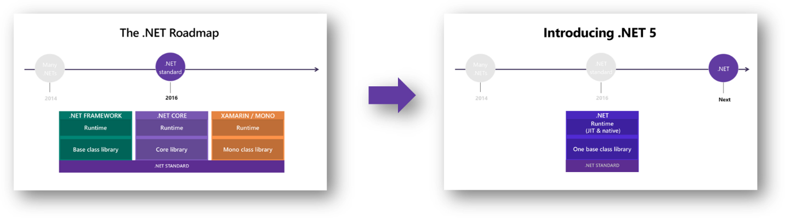
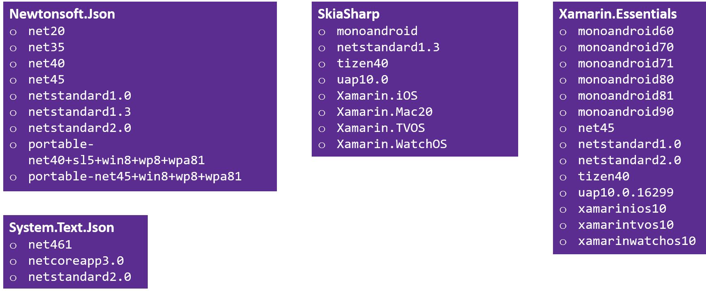
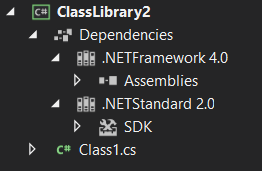
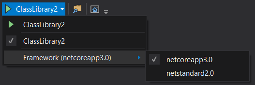

# Target Framework Names in .NET 5

**PM** [Immo Landwerth](https://github.com/terrajobst) |
[Video Presentation](https://youtu.be/kKH8NzvtENQ?t=694)

We'd like to drastically simplify the framework names (TFMs) developers must use
in project files and NuGet packages. This includes merging the concept of .NET 5
and .NET Standard while still being able to use `#if` to use OS-specific APIs.
This document explains the motivation and resulting developer experience.

.NET, as most technologies that are two decades old, has a lot of heritage,
especially in product naming and editions: .NET Framework, .NET Compact
Framework, Silverlight, .NET Micro Framework, .NET Portable Class Libraries,
.NET for Windows Store, .NET Native, .NET Core, .NET Standard... and that
doesn't even include what the Mono community built. While this evolution of .NET
can be explained (and was properly motivated) it created a massive tax: the
concept count. If you're new to .NET, where would you start? What is the latest
stack? You may say, “of course that's .NET Core” but how would anyone know that
by just looking at the names?

We've simplified the world with .NET Standard, in that class library authors
don't have to think about all the different “boxes” that represent different
implementations of .NET. It did that by unifying the *API surface* of the
various .NET implementations. Ironically, this resulted in us having to add yet
another box, namely .NET Standard.

To make the future saner, we must reduce the number of boxes. We don't want to
make .NET less flexible, but we want to reduce nonsensical differences that
purely resulted from us not being open source early enough. For example,
Mono/Xamarin/Unity are based on a different set of runtimes and frameworks than
the .NET Framework/Silverlight/UWP/.NET Core lineage. With .NET Standard, we
have started to remove the differences in the API surface. With .NET 5, the goal
is to converge these lineages onto a single product stack, thus unifying
their *implementations*.



While we strive to provide an experience where you don't have to reason about
the different kinds of .NET, we still don't want to fully abstract away the
underlying OS, so you'll continue to be able to call OS specific APIs, be that
via P/Invokes, WinRT, or the Xamarin bindings for iOS and Android APIs.

Now think about developers who start on this stack and can write any application
for any of the platforms that .NET provides support for. The branding we
currently have makes no sense to them. To find documentation and tutorials, the
only two things a developer should need to know is the name and version of their
technology stack.

Let's contrast this with some of the NuGet packages that developers have to
author for today's world:



There are a lot of names and version numbers. Knowing who is compatible with who
is impossible without a decoder ring. We've simplified this greatly with .NET
Standard, but this still requires a table that maps .NET Standard versions to
.NET implementation versions.

The proposal is to reuse the existing net TFM and model OS-specific APIs on top
via a new syntax:

* `net5.0`. This TFM is for code that runs everywhere. It combines and replaces
  the `netcoreapp` and `netstandard` names. This TFM will generally only include
  technologies that work cross-platform (modulo pragmatic concessions, like we
  already did in .NET Standard).

* `net5.0-win`, `net5.0-ios`, `net5.0-android`. These TFMs represent OS specific
  flavors of .NET 5 that include `net5.0` plus OS-specific bindings.

NuGet should use this next syntax to automatically understand that `net5.0` can
be consumed from `net6.0-win` (but not the other way around). But more
importantly, this notation will also enable developers to intuitively understand
compatibility relationships because they are expressed by naming, rather than by
mapping tables. Yay!

## Scenarios and User Experience

### Vary implementation

Ida is working on a Xamarin Forms application that supports Android, iOS, and
Windows. Her application needs GPS information, but only a very limited set.
Since there is no portable GPS API, she writes her own little abstraction
library using multi-targeting.

By doing so, she's able to encapsulate the GPS access without having to
multi-target her entire application, just this one area.

```C#
public static class GpsLocation
{
    public static bool IsSupported
    {
        get
        {
#if ANDROID || IOS || WINDOWS
            return true;
#else
            return false;
#endif
        }
    }

    public static (double Latitude, double Longitude) GetCoordinates()
    {
#if ANDROID
        return AndroidAPI();
#elif IOS
        return AppleAPI();
#elif WINDOWS
        return WindowsAPI();
#else
        throw new PlatformNotSupportedException();
#endif
    }
}
```

### Vary API surface

Ada is a developer on SkiaSharp, a cross-platform 2D graphics API for .NET
platforms based on Google's Skia Graphics Library. The project is already using
multi-targeting to provide different implementations for different platform. To
make it easier to use, she's adding a new `SkiaSharpImage` type, which
represents a bitmap and is constructed via OS-provided data types. Ada uses
`#if` to expose different constructors on different platforms:

```C#
public static class SkiaSharpImage
{
#if ANDROID
    public SkiaSharpImage(Android.Media.Image nativeImage) { /* ... */  }
#endif

#if IOS
    public SkiaSharpImage(NSImage nativeImage) { /* ... */ }
#endif

#if WINDOWS
    public SkiaSharpImage(Windows.Media.BitmapImage nativeImage) { /* ... */ }
#endif
}
```

## Requirements

### Goals

* Use naming that aligns with product strategy
* Merge .NET Core and .NET Standard into a single concept
* Developers should be able to understand compatibility relationships without
  having to consult a mapping table.
* Provide compatibility with existing concepts and NuGet packages
* It would be great to get this into .NET 5 Preview 1

### Non-Goals

* Replace TFMs or expand runtime identifiers (RIDs)
* Support multi-targeting between OS versions

## Design

| TFM             | Compatible With                                            | Comments                          |
|-----------------|------------------------------------------------------------|-----------------------------------|
| net5.0          | net1..4 (with NU1701 warning)                              | No WinForms or WPF                |
|                 | netcoreapp1..3.1 (warning when WinForms/WPF is referenced) |                                   |
|                 | netstandard1..2.1                                          |                                   |
| net5.0-android  | xamarin.android                                            |                                   |
|                 | (+everything else inherited from net5.0)                   |                                   |
| net5.0-ios      | xamarin.ios                                                |                                   |
|                 | (+everything else inherited from net5.0)                   |                                   |
| net5.0-macos    | xamarin.macos                                              |                                   |
|                 | (+everything else inherited from net5.0)                   |                                   |
| net5.0-tvos     | xamarin.tvos                                               |                                   |
|                 | (+everything else inherited from net5.0)                   |                                   |
| net5.0-watchos  | xamarin.watchos                                            |                                   |
|                 | (+everything else inherited from net5.0)                   |                                   |
| net5.0-win      | netcoreapp1..3.1                                           | WinForms + WPF                    |
|                 | (+everything else inherited from net5.0)                   |                                   |
| Tizen, Unity... | Will follow the Xamarin model                              |                                   |

_**Open Issue**. In case of Xamarin, there is a discussion of whether the
convergence with .NET Core will be a breaking change for existing NuGet packages
(for example, there is a desire to change their namespaces). In that case, we
should not map it to the existing TFM as that would be pointless._

_**Open Issue**. Will the above scheme work for iPad?_

### Mapping to properties

There are three existing MSBuild properties:

| Property                        | Meaning            | Examples                         |
|---------------------------------|--------------------|----------------------------------|
| TargetFramework (TFM)           | The friendly name  | `net4`, `netcoreapp3.0`          |
| TargetFrameworkIdentifier (TFI) | The long name      | `.NETFramework` or `.NETCoreApp` |
| TargetFrameworkVersion (TFV)    | The version number | `2`, `3.0`, `3.1`                |
| TargetFrameworkProfile (TFP)    | The profile        | `Client` or `Profile124`         |

_**Open Issue**. The SDK has this logic duplicated from NuGet because they need
to do this during evaluation where they can’t call custom targets. We could make
this an MSBuild intrinsic, but that seems like a lot of work. Maybe we just live
with the duplication. But bottom line is that we need to make that change in
MSBuild too._

* [@rainersigwald](https://github.com/rainersigwald): We've made it pretty far
  with duplicated logic, but it results in really ugly MSBuild, since it's not a
  very expressive programming language. It also creates the potential for drift
  between the two definitions. That said, exposing it directly would create a
  new tight coupling between MSBuild and NuGet that hasn't historically existed.
  It would probably require a direct dependency and update flow plus coherency
  requirements on both .NET Core SDK and VS insertions. If the logic were in a
  separate package (we've talked about pushing it down to the framework at
  various times) it'd be great to just expose that. With the logic in NuGet,
  it's reasonable either way, just different tradeoffs. I'm amenable to exposing
  a property function, but maybe we should go down the road of not doing it at
  first.

We're going to map the new entries as follows:

| Framework      | Identifier    | Version | Profile |
|----------------|---------------|---------|---------|
| net48          | .NETFramework | 4.8     |         |
| net5.0         | .NETCoreApp   | 5.0     |         |
| net5.0-android | .NETCoreApp   | 5.0     | android |
| net5.0-ios     | .NETCoreApp   | 5.0     | ios     |
| net5.0-win     | .NETCoreApp   | 5.0     | win     |

_**Open Issue**. Please note that `net5.0`+ will map the TFI to `.NETCoreApp`.
We need to announce this change so that package authors with custom .props and
.targets are prepared. Link to DavKean’s doc on how to do it._

_**Open Issue**. We should try to keep the TFI out of the .nuspec file. It seems
NuGet uses the long form `.NETFramework,Version=4.5` in the dependency groups.
We may want to change NuGet to allow the friendly name there as well and update
our packaging tools to re-write to friendly name on pack._

Specifically:

* **We'll continue to use .NETCoreApp as the TFI**. This reduces the number of
  pieces and build logic that needs to change in .NET SDK.

* **net4x and earlier will continue to use .NETFramework as the TFI**. This
  means that `net4x` and `net5.0` aren't considered compatible by default, but
  the compatibility will continue to be handled by the AssetTargetFallback in
  the SDK/NuGet restore.

* **We'll use the existing profile concept to encode the OS selection.** It's
  worth noting that profiles today make things smaller whereas this use makes
  things larger. We believe this can be handled in the NuGet layer by using this
  rule for `net5.0` and up. While that's not ideal, it reduces the number of
  concepts we need to add.

### TFMs are a closed set

One question is whether third parties can extend the TFM space (that is, the
part after the dash) without having to rely on changes in NuGet/MSBuild. Due to
the expansion of friendly name into TFI & TFM this would be non-trivial.

We may open this up in the future, but for now the consensus was that we'd
prefer to have the specific list of names that are expanded by NuGet.

### What about .NET 10?

Due to the fact that we're planning to bump the major version every year, we
have to think about what will happen with version parsing in case of two digit
version numbers, such as `net10`. Since `net10` already has a meaning (.NET
Framework 1.0), we need to keep it that way. To avoid surprises, we'll by default
use dotted version numbers in project templates to push developers towards being
explicit.

| Framework      | Identifier    | Version| Comment
|----------------|---------------|--------|----------------------------------
| net5           | .NETCoreApp   | 5.0    | Will work, but shouldn't be used.
| net5.0         | .NETCoreApp   | 5.0    |
| net10          | .NETFramework | 1.0    |
| net10.0        | .NETCoreApp   | 10.0   |

### Preprocessor Symbols

* TODO

Today, implicit `#if` conditions get generated based on the
`TargetFrameworkIdentifier`, so users today have:

```C#
#if NETCOREAPP
#elif NETFRAMEWORK
#endif
```

With this proposal, the `#if NETCOREAPP` condition will still be available when
targeting `net5.0`, `net6.0`, etc. and will also be turned on for
`netcoreapp2.1`, `netcoreapp3.1`, etc. Is that intended? Do we want a new
implicit condition that is versionless but targets all TFMs above `net5.0`? That
is, `#if NET`.

### Persisting prerequisites

We need to require a minimum version for the iOS/Android/Windows SDKs.

* Probably like how we did WinForms/WPF
    - WinForms/WPF uses a framework reference which by design doesn't have a
      version number
    - We'd need something with a version number

This work is captured [in this document][os-versioning].

### What would we target?

Everything that is universal or portable to many platforms will target `net5.0`.
This includes most libraries but also ASP.NET Core and EF.

Platform-specific libraries would target platform-specific flavors. For example,
WinForms and WPF controls would target `net5.0-win`.

Cross-platform application models (Xamarin Forms, ASP.NET Core) and bridges
(Xamarin Essentials) would at least target `net5.0` but might also additionally
target platform-specific flavors to light-up more APIs or features. This
approach is also called bait & switch.

### Target Framework Names

There are some places in the IDE where targeting information is displayed:






| Rule                                                                                                        | Affected UI                                                        |
|-------------------------------------------------------------------------------------------------------------|--------------------------------------------------------------------|
| For most UI, we should use the TFM friendly name (for example, `netcoreapp3.1`, `net5.0`, or `net5.0-ios`). | Solution Explorer Editor, Context Switcherm Debug Context Switcher |
| For cases where we use branded display names, we should use the name .NET 5.                                | Project Properties                                                 |

### Related work

To support multi-targeting end-to-end the TFM unification isn't enough. We also
need to unify the SDKs between .NET Core, Windows desktop, Xamarin, and
maybe ASP.NET Core. Without it, multi-targeting doesn't work without having to use
3rd party tools, such as Oren's
[MSBuild.Extras](https://github.com/onovotny/MSBuildSdkExtras).

We should also make it easier to catch cases where some APIs aren't universally
available anymore. This includes fundamentals like threading for platforms like
WASM but also version-to-version differences in OS API surface. We already have
[an analyzer](https://github.com/dotnet/platform-compat), but we need to expand
this and make it a key capability that is available out-of-the-box.

## Q & A

### Why can't we just have a single TFM for .NET 5?

Moving forward, we can assume that the base class library (BCL) of .NET is the
same across all environments of .NET. One can think of `net5.0` as .NET Standard
but with an implementation (.NET Core).

However, `net5.0` will not include .NET projections of OS APIs, such as:

* WinRT
* iOS bindings
* Android bindings
* Web assembly host APIs

We *could* make all APIs available everywhere. For example, we could create one
NuGet package per OS-platform and include two implementations, one that throws
and one that works. The package would use RIDs to select the correct
implementation, but it would have a uniform API surface. Callers of those
packages would use platform checks or catch `PlatformNotSupportedException`.

We believe this isn't the right approach for two reasons:

1.  **Number of moving pieces**. Imagine what a simple class library would look
    like that just wants to provide an abstraction over a single concept, such
    as the GPS. It would transitively depend on all OS bindings. Regardless of
    the platform you're building your application for, the output folder would
    have to include all bindings across OS platforms, with all being throwing
    implementations except for the one that your app is targeting. While we
    could build tooling (such as a linker) that could remove this and replace
    the call sites with throw statements, it seems backwards to first create
    this mess and then rely on tooling to clean it up. It would be better to
    avoid this problem by construction.

2.  **Versioning issues**. By making the OS bindings available on top of the
    .NET platform the consumer is now able to upgrade the .NET platform and the
    OS bindings independently, which makes it hard to explain what combinations
    are supported. In practice, the OS bindings will want to depend on .NET
    types which might change over time (think `Task<T>` or `Span<T>)`, so not
    every combination can work.

We believe it's much easier if we enable code to use multi-targeting (that is,
compile the same code for multiple platforms, like we do today.

### Is .NET 5 a superset of .NET Framework 4.x?

No, .NET 5 isn't a *superset* of .NET Framework. However, .NET 5 is
the *successor* of both .NET Core 3.x as well as .NET Framework 4.x. Starting
with .NET Core 3, you can build the same kind of workloads that you can with
.NET Framework. Some of the tech has changed, but that's the way it's [going to
be forever](https://devblogs.microsoft.com/dotnet/net-core-is-the-future-of-net/).
The remaining delta will never be closed. Existing apps can stay on .NET
Framework and will be supported, but we already said we'll no longer add new
features to it.

Thus, new apps should start on .NET Core. By branding it as .NET 5, this
recommendation is much more obvious to both existing customers and new
customers.

### Why are the OS specific flavors not versioned by the OS?

There are two reasons why this isn't desirable:

1.  **It results a combinatorial explosion**. A TFM in the form of `net5.0-win7`
    would (syntactically) make any combination of .NET and OS possible. This
    raises the question which combinations are supported, which puts us back
    into having to provide the customer with a decoder ring.

2.  **It can make asset selection ill-defined**. Suppose the project is
    targeting `net7.0-win10`. The package offers `net5.0-win10.0` and
    `net6.0-win7.0`. Now neither asset would be better.

Developers will want to target different OS versions from a single code
base/NuGet package, but that doesn't mean they will need to use multi-targeting.
Multi-targeting is a very heavy hammer. Yes, many people are using it to target
different versions of .NET (for example, `net45` vs `net461`). But that's not
necessarily because `#if` is the better experience, it's because it's simply not
possible any other way, due to .NET runtime constraints (that is, assembly
references and type/member references need to be resolved by the JIT). This
problem doesn't exist for OS APIs. Developers can generally build a single
binary for multiple versions of an operating system. The calls to APIs
introduced in later versions must be guarded, but this is generally understood,
and we have some limited tooling already with plans to extend it.

However, we do want to allow the developer to express a minimum version they
require for the OS. It will likely be a property in the project file that is
being persisted in the resulting NuGet package as well. There is a separate doc
that we're working on.

### Why is there no TFM for Blazor?

Based on conversations with the Blazor team we decided to not create a TFM for
WASM in the browser. That's because Blazor wants agility where code can
transparently work on client and server. Thus, they will continue to use
`net5.0`. The browser-specific APIs will be delivered as a NuGet package, using
RIDs to provide a throwing and non-throwing implementation. Other parties will
have to do the same thing.

### ~~Why is the TFM called net5.0-browser and net5.0-wasm?~~

*No longer applicable as we won't have a TFM for Blazor.*

WASM isn't a platform (in the OS sense) as much as it is an instruction set
architecture, so it's better to think of WASM as something like x86/x64. So, it
might not make sense to define `net5.0-wasm`. Rather, it would make more sense to
define `net5.0-browser`. The rationale is that the browser will run WASM in a
sandboxed environment which equates to having different native API sets.

Any host that controls the JS runtime (for example, Node.js) could decide to expose
different/less constrained OS, which might give rise to other TFMs, such as
`net5.0-node`.

### What about native dependencies?

We don't plan to support varying API surface based on runtime characteristics
(x86/x64, AOT/JIT etc). This will continue to be supported via
the `runtime/<RID>` folder.

### Will the new TFMs simplify the project files too?

[@cartermp](https://github.com/cartermp) asked:

> Does specifiying `net5.0-win` obviate the current three things you need to
> specify?
>
> * netcoreapp3.x
> * Desktop SDK attribute
> * UseWindowsForms/UseWPF
>
> IOW are we going to have to support both formats moving forward? What about
> converting apps?

Generally, it does not. The idea I've heard is that all project types will be
unified to use `Sdk="Microsoft.NET.Sdk"` in order to make multi-targeting
easier. Customizations (for example, specific targets and references) would be brought
in via `UseXxx` properties, akin to how Windows Forms and WPF work in .NET Core
today. The reason is that in many cases the TFM alone isn't specific enough to
decide what kind of app are you building:

* `net5.0`. Is a class library/console app, an ASP.NET Core app, or a Blazor app?
* `net5.0-win`. Are you building a Windows Forms app or a WPF app? Are you using
  both Windows Forms and WPF or just one?

The nice thing about properties is that they naturally compose. If certain
combinations aren't possible, they can relatively easily be blocked.

However, at this point it's still unclear whether the SDK unification will work
this way. One concern was that SDKs also bring in new item groups and might have
conflicting defaults for properties; this works today because the SDK can bring
in .props before the project file. When we rely on properties in the project
file, we need to bring those in the .targets (that is, the bottom of the project
file). While not impossible, this might force us to have knowledge in the base
SDK that can't be easily extended via optional components.
[@mhutch](https://github.com/mhutch) is working on a document specifically
around SDK convergence.

[os-versioning]: https://microsoft.sharepoint.com/:w:/t/DotNetTeam/EavsPfFy7lFLh7eQrdMN8QwBl05cGLPwrSzJeT8vEu32mw?e=knNQ6W