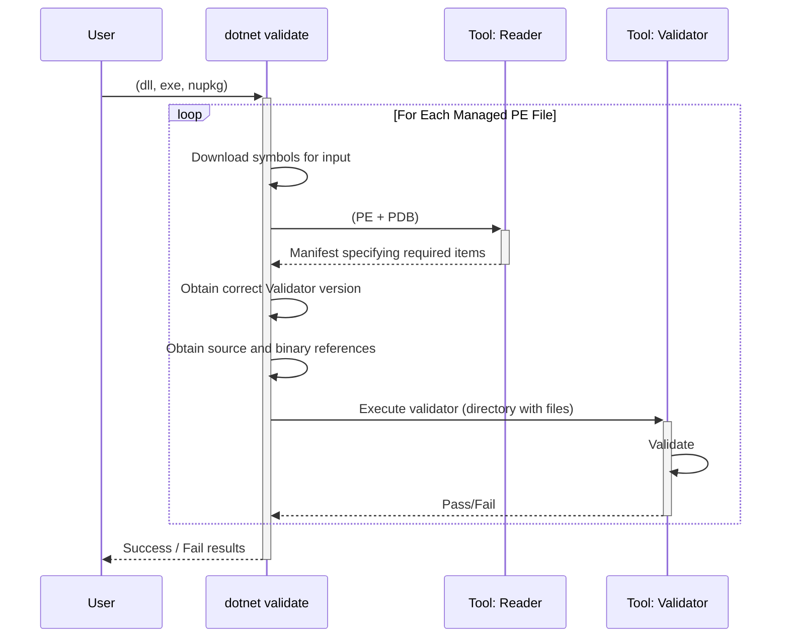

# Reproducible Build Validation

**Owner** [Claire Novotny](https://github.com/clairernovotny) | [Jared Parsons](https://github.com/jaredpar)

## Overview

.NET's ecosystem uses binaries as the primary exchange mechanism. This solves various problems, especially shielding the consumer from having to replicate the build environment. It's also what enables the multi-language ecosystem. All in all, binaries have worked well for .NET, especially because the underlying format is rich and self-describing.

.NET uses Authenticode signing for binaries and packages. The .NET Foundation has made it easier for member projects to get a code signing certificate and actively pushes its projects to do so. On top, the official NuGet gallery signs packages to indicate they came from nuget.org.

However, one largely unsolved problem is the link between source code and binaries. While a significant portion of packages on nuget.org are open source and often link to a commit in a GitHub repo, there is no way to ensure that the source code at that commit actually matches the binaries submitted to nuget.org. In other words, just because a developer can trust the source code doesn’t mean they can trust the binaries came from that source. And while nuget.org scans packages for virus and malware, there is no way to detect all possible malware. For all they know, someone, or something, [injected a bitcoin miner](https://www.theregister.com/2018/11/26/npm_repo_bitcoin_stealer/).

Also, should package consumers find a zero-day exploit, they usually have no way to patch the binaries themselves. They must find the corresponding repo, get the necessary dependencies for building it, somehow find the correct version of the code, patch it, and then rebuild. Not an easy task under ideal circumstances, much less viable when time is of the essence.

To address these problems, we will create a set of tooling that for each managed binary file in a NuGet package, will be able to enumerate all of the input sources used to create it, validate they are accessible and validate that the resulting binary matches was produced using those sources files. In doing so, we don't need to trust the original build environment, as we're able to independently create the managed file from the input sources.

## Scenarios and User Experience

### Customer Cohorts

- Package consumers who wish to manually check results on their own.
- Package authors who wish to verify their package is reproducible.
- Package hosts, such as NuGet.org and Terrapin, who wish to validate packages on upload and present the status as part of overall package/project health.

### End-to-end scenarios

#### Developer or InfoSec that wants to validate on their own

An internal package security team is wants to reduce their supply chain risk to their apps and services. They want to make sure that the binaries being used can be traced to sources so they can run security scans on the source code. The packages being validated are produced from a mix of public and internal sources. The team sets up infrastructure to run the validation tool for each package they use.

Due to organization security requirements, based on likely forthcoming NIST standards, they must be able to trace the source and rebuild all packages being used.

1. For each managed binary in the NuGet package, call a tool to check the status. Result is one of: not buildable, buildable but not verifiable (builds but not the same deterministic output), or deterministically reproducible.
2. If all of the managed binaries are deterministically reproducible, the package is marked as reproducible/validated.

#### Developer creating a library

A developer is updating their library and wants ensure that it can be successfully validated so their users feel secure in taking a dependency on it, and that NuGet.org will give it a higher health score.

The developer knows that by updating to the latest .NET SDK, they are secure by default because the right settings are automatically enabled for their project:

- Source Link
- EmbedUntrackedSources
- PublishRepositoryUrl
- Latest Roslyn compiler which stores compiler flags into the PDB
- PDB is automatically included in the NuGet package
- Strong name keys are checked into source control

After building and publishing the package using the latest SDK, NuGet.org validates the library and assigns a higher score.

#### Developer using NuGet.org

A developer is searching for a logging library on NuGet.org. They search and see two interesting libraries, one with a "verified" badge, and the other without. The developer picks the verified one, and feels confident that the package they're using does not contain code they are not aware of and have visibility to. They trust NuGet to have validated that the package meets the specified supply chain requirements.

#### Corporate / Government developer at a large organization

A developer in an internal team building a service needs to make sure they comply with their supply chain requirements. They use a feed containing only validated packages provided by their internal InfoSec team.

#### NuGet

NuGet is looking at ways to improve the security of the ecosystem and provide metrics around project/package health. Ensuring that the binaries in the project match the source is an important part, ensuring no tampering occurs in the build pipeline.

NuGet will add a validation step on package ingestion:

1. For each managed binary in the NuGet package, call a tool to check the status. Result is yes/no.
2. If all of the files are successful, the package is marked as reproducible. If a package contains unmanaged binaries, then the result would be interterminite and marked accordingly.
3. For each managed binary or PDB file in the package, add it to the NuGet symbol server. NuGet will retroactively do this step for all existing packages to-date.

NuGet will allow packages that are not reproducible to be ingested; failure is not a hard block. NuGet will display the reproducible status in appropriate metadata and UI so users and tools that trust NuGet can make informed decisions without revalidating themselves.

## Requirements

### Goals

**P0**

- The validation tool must work on any managed binary, regardless of target framework
- The validation tool must work on any operating system.
- The validation tool must support public sources for sources and symbols.
- The validation tool must be easy to use: single command the user invokes.

**P1**

- The validation tool should support non-public source and symbol locations given credentials.

**P2**

- The validation tool should support F#
- The validation tool should support any .NET SDK tool which creates or modifies DLL / EXEs

**Future**

- Support for IL weavers

### Non-Goals

- Evaluating provenance of embedded resources, such as .resx or .baml.
- Support for modification or patching during validation, to create a runnable binary that's functionally different from the original.
- Support for exporting a rebuilt artifact
- Supporting the tool being used to validate binaries in an environment different than what they were produced on. 
- Validation of transitive dependency chain
- Validation of existing packages. The feature requires new metadata added to the pdb.

## Design

The user experience is delivered through a .NET CLI tool, `dotnet validate ThePackage.nupkg` or `dotnet validate TheFile.dll`. The tool will be responsible for obtaining symbols from well-known symbol servers (NuGet public symbols, MSDL) and whatever the user's configured [symbol path](https://docs.microsoft.com/en-us/windows-hardware/drivers/debugger/symbol-path) is.

To manually validate a NuGet package, they can download it from NuGet.org or by using a `dotnet nuget download <packageId>` CLI command.

Source files generated as part of the build pipeline are supported (eg. Source Generators, Code Behind) when `EmbedUntrackedSources` or `EmbedAllSources` is set to `true`. The generated sources are stored in the PDB file and are thus available for the validation steps. Source generators and other tooling are not re-executed, rather, the sources are extracted from the PDB and reused as input.

IL weavers and trimmers won't be supported by the first version of the tool. We don't anticipate trimming is as relevant for libraries as we expect trimming to be primarily used by applications. The majority of libraries do not presently use weavers, so we are able to improve overall security even if we aren't able to validate those libraries. A future version would define a mechanism where weavers and trimmers would participate in the validation steps by storing their input settings in the pdb and providing a mechanism to obtain the specific version used, allowing it to be run again. The tools would also need to be deterministic with respect to their inputs.

The tools require the following artifacts to work:

- Portable PDBs (embedded is supported)
- Binary references (referenced assemblies)
- Source

### PDBs

PDBs are a critical component as they contain pointers to the original source, or embeded source. They also contain information about the binary references and compiler flags used during the original compilation.

### Binary references

Any file used as a reference to the compiler must be available when rebuilding to use as a reference again.

### Source

Source may be retrieved either from an online location, as specified in the PDB (and validated against the PDB's checksums), or embedded in the PDB. Source generated as part of the build, like from source generators or generated UI code-behind, is exected to be embedded as it would not be available in the repo.

The tool would obtain the artifacts from a symbol server (as it already contains the ability to index any PE file and PDB) and HTTPS/local source location. Microsoft's primary symbol server (MSDL) already contains both PE files and PDB's. NuGet's symbol server needs to be extended to include PE files and Windows PDB's for all packages.

Authenticating to a source location or symbol server should be handled by the tool in an appropriate way (Git Credential Manager, etc).

### User Experience

Happy path

```
dotnet validate TheFile.dll --verbose
Obtaining symbols for TheFile.dll
...trying msdl.microsoft.com: Not Found
...trying symbols.nuget.org: Found
File contains source link information
Generating manifest to c:\temp\config...
Downloading source files to c:\temp\sources....
Downloadng reference files c:\temp\references
... trying to get System.dll from msdl.microsoft.com: Found
... trying to get AutoMapper.dll from msdl.microsoft.com: Not Found
... trying to get AutoMapper.dll from symbols.nuget.org: Found
All artifacts downloaded, validating...

File validated successfully.
```

Error conditions will output relevant troublshooting data:

```
dotnet validate ThePackage.nupkg
ERROR: TheFile.dll was not built with deterministic settings
ERROR: SomeSource.cs could not be found
ERROR: this DLL was built on a different operating system
ERROR: this DLL was built using a .NET Runtime which is not available on this machine
```

### Functions

- For a given .NET library (DLL) or executable
    1. has all sources identifiable
    2. has all sources accessible (provenance)
    3. does not include code/functionality beyond those identified (excluding resources)
    4. provides a simple pass/fail output value
- Allow security supply chain validation
    1. Validate IL matches
    2. Ignores signatures/signing (strong naming, certs)
    3. Does recreate embedded resources, extracts and reuses them as-is
    4. ~~Does not support multiple line endings~~
- Allow rebuild validation across supported versions of Windows or Linux
    1. ~~Support SOURCE_DATE_EPOCH standard~~
- Allow the identification and acquisition of correct compiler and runtime version
    1. Support automatic acquisition while versions covered by our support policy 
    2. Support validation with customer-provided compiler/runtime, including validation of provided artifacts via signing/hash, for validation outside our support policy
- When validation fails, users receive details on
    1. What minimum toolchain requirements have not been met to enable validation
    2. What compilation requirements have not been met to enable validation
    3. What required artifacts (compiler) could not be acquired automatically
    4. What sources/code/bits were unable to be acquired and/or validated
    5. Missing platform/OS requirements
- Users can optionally receive a report containing
    1. Identified sources and, when possible, their location (URI), commit, and hash
    2. Identified embedded resources and their location within the supplied artifact and hash
    3. Identified symbols and their location (URI)
    4. Identified compiler switches
    5. Requires tools (compiler/runtime) and their location (URI)
    6. What OS is required
    7. Any validation failure messages

### Interaction Flow




Partial implementation: https://gist.github.com/jaredpar/93a476b6e102d489b0d33d8073de17b5

## Q & A

### **Q:** How is this related to https://reproducible-builds.org/?

**A:** The building a managed binary involves many components, including ResX, XAML->BAML, strong naming, and MSBuild, that can be customized in countless different ways. This effort focuses only on the executable code, ignoring strong naming, resource generation, re-running source generators, etc.
