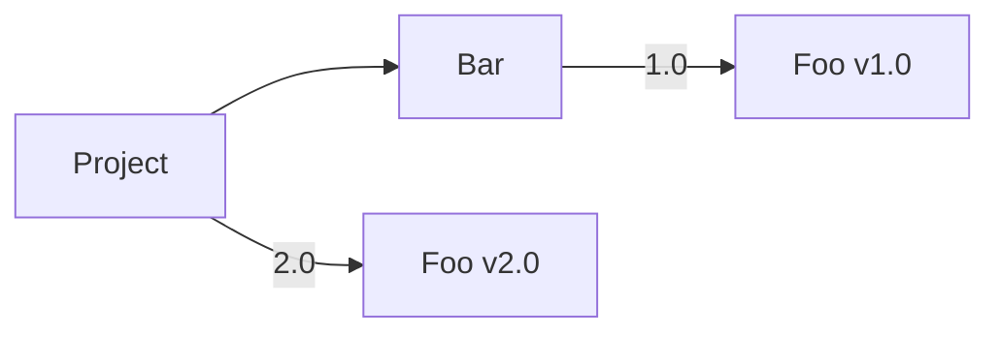
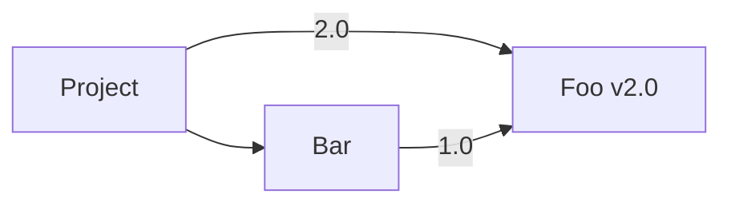
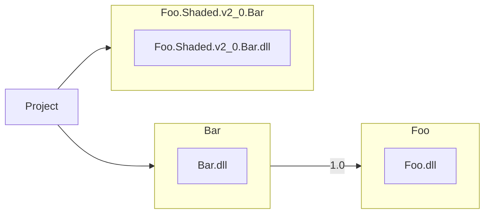
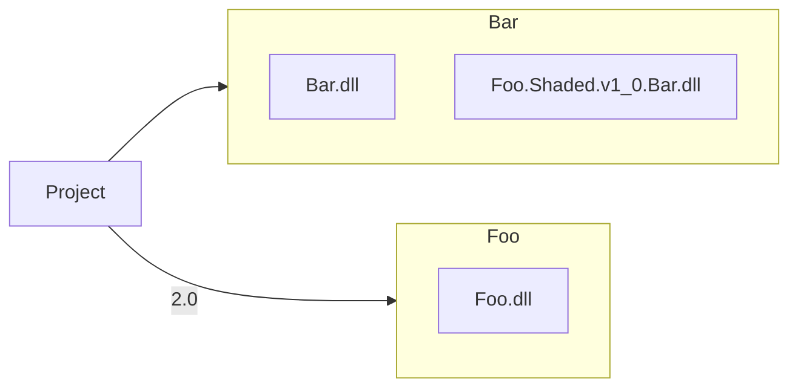
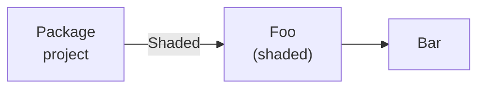
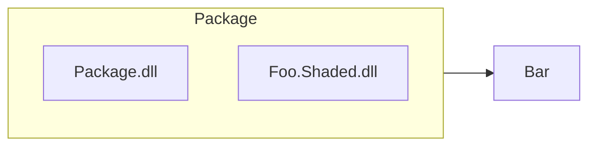
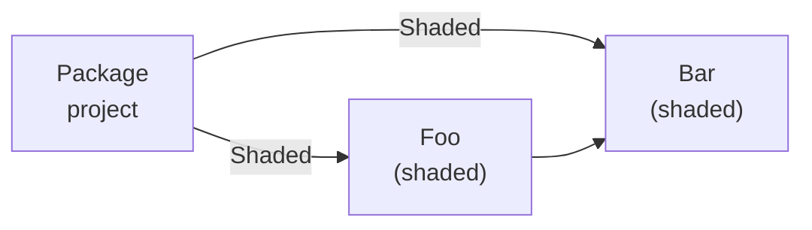
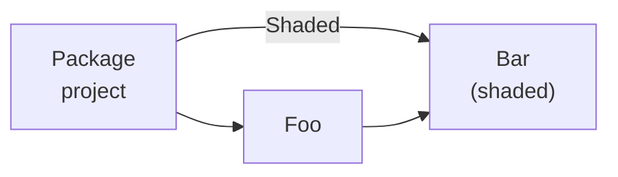

# Experiment: NuGet Package Shading

**Owner** [Mikayla Hutchinson](https://github.com/mhutch)

## Introduction

Producer-side package shading is an experimental feature that allows a NuGet package author to "shade" a dependency: embed a renamed copy of it in their package. This ensures that consumers of the package get the exact same version that the package author intended, regardless of any other direct or indirect references to that dependency.

**The major downside to producer-side shading** is that the shaded assemblies are included in the app even when they are identical or completely compatible with other shaded or non-shaded copies of the same dependency. This forced redundancy is a problem for scenarios where app size and memory use is highly important such as mobile apps and client-side web apps, **so producer side shading is not intended to ever become non-experimental or recommended for general use**.

The preferred long-term solution is consumer-side shading, where shading is performed holistically for an app, where it shade packages only when necessary, and deduplicate compatible and identical shaded assemblies.

Producer-side shading uses same building blocks as consumer-side shading, but is substantially smaller in scope. It also has the advantage that consumers of a producer-side shading package do not need tooling that understands shading.

Developing and releasing producer-side shading as an experimental feature allows us to build out and test some of the underlying mechanisms for consumer-side shading, while making shading functionality available in the near term to package authors who need it to solve specific problems they are encountering.

## Background

### Dependency unification

To understand why shading is needed, we must understand dependency unification and the problems it can cause.

NuGet only allows a single version of each package to be resolved in the package graph. When a project has multiple references to the same package, NuGet must *unify* them to a single version. This frequently happens with transitive references to common packages such as `Newtonsoft.Json`.

To demonstrate this, consider an example where a project references package `Foo v2.0` and package `Bar`, and `Bar` depends on `Foo v1.0`:



The project *transitively* depends on `Foo v1.0` and directly depends on `Foo v2.0`. A project cannot depend on multiple versions of the same package, because this would cause conflicts and ambiguity. NuGet must *unify* the two differently versioned Foo dependencies to a single version in the context of that project.

> **NOTE** Unification is independent for each project. All the direct and transitive dependencies for each project must be unified in the context of that project, but the result of unification is specific to that set of dependencies. Another project in the same solution with different dependencies and/or dependency versions may unify to different versions of the same dependencies.

NuGet performs unification based on the dependency versions defined in the referencing packages or projects. Dependency versions may be exact, an explicit range, or a simple version that implicitly means "equal to or greater than". In the above example, the `v1.0` dependency means `>= v1.0`, so it is compatible with `v2.0`, and NuGet can unify them:



 ### Impact on package consumers

 When different versions of a dependency cannot be unified, NuGet restore fails with errors that are often difficult to understand (`NU1605`, `NU1107`). These errors currently make up a majority of NuGet restore errors. In some cases unification is possible but not automatic, in which case a developer may opt in by adding a direct reference to the dependency, but this is not straightforward.

Even when dependencies are unified, the result may not be correct. The versions of the dependencies may make them appear to be compatible when they are not. This can result in compiler errors, runtime errors, and behavioral differences.

Runtime errors and behavioral errors in particular can be extremely difficult to find and diagnose. They may only be observed in production, and it may not be clear where they originate. These kinds of issues are often not attributed to NuGet, so NuGet unification issues likely represent a much bigger problem than the restore error codes would indicate.

### Impact on package authors

Unification problems create issues for package authors, not just consumers:

* **Package consumers may be averse to installing or updating** a reference to a package if it depends on another package used in their app, as unification may change the version of that package and cause problems elsewhere in their app.
* **Package consumers may not be able to install or update** a reference to a package if it depends on a package that their project already depends on but the versions are different and cannot be unified.
* **Unification issues may appear to be bugs in the package itself** if unification causes one of the package's dependencies to have a different version than it specified and it is not compatible with that version.

Some package authors go out of their way to avoid dependencies so that they will not cause unification problems for their consumers.

## Shading

Shading makes a dependency immune to unification problems by giving it a new identity so it is not unified with any other dependency. When a dependency is shaded, the dependency and its assets are renamed so that it does not conflict with any other copies of that dependency that are directly or transitively referenced by the referencing project.

To demonstrate how shading works, we will start with our example from earlier. We have a project that depends directly on package `Foo v2.0` and transitively on `Foo v1.0` via a direct reference to package `Bar`.


Suppose that `Foo v2.0` has major API changes since `Foo v1.0` and has both added new APIs and removed old APIs. The author of the project has referenced `Foo v2.0` directly, because they want to use its cool new APIs, but they already depend on `Bar`, which internally uses the old `Foo v1.0` APIs that were removed in `Foo v2.0`. The author of the package `Bar` has not migrated to `Foo v2.0` because they depend on an advanced option from `Foo v1.0` that is not exposed in the new `Foo v2.0` APIs.

If NuGet has sufficient information to determine that these dependencies are not compatible, then it will not unify them, and the project will not restore. On the other hand, if it *does* unify `Foo v1.0` and `Foo v2.0`, and the project uses `Bar` APIs that depend on the Foo APIs that were removed in `Foo v2.0`, then the project will have will get run-time errors such as `MissingMethodException` and `TypeLoadException`.

With **consumer-side shading**, at restore time NuGet would identify that the two versions of `Foo` were incompatible and that it needed to shade one of them. It would create a local copy of `Foo v2.0` renamed to some shaded name such as `Foo.Shaded.v2_0.Bar` and substitute it in place of `Foo v2.0`:



With **producer-side shading**, the author of `Bar` would anticipate this unification problem and shade their `Foo` dependency at the time they build their packages, embedding a renamed copy of the `Foo v1.0` assets in their package:



## Concerns

Package shading is fundamentally inefficient. Its entire purpose is to cause an app to include and load multiple copies of the same library, and the inefficiency is the cost you pay to solve incompatibilities in your dependencies.

Loading multiple copies of the same library increases an app's download size and memory use, which is particularly problematic in mobile and client-side web applications. Mobile devices have limited memory and will terminate backgrounded applications if they use too much memory, and users may be reluctant to download an app if it's too large, particularly on client namespaces.

A major downside to shading is that an app will end up with multiple copies of the same library, even when those copies are compatible or identical. This is particularly problematic in mobile and WebAssembly where app size is important and significant effort has been invested in .NET to reduce app size. This solution should be considered an intermediate step towards a more complete, whole-app solution that is able to unify compatible shaded dependencies.

Shading also prevents a consumer from updating a shaded dependency directly even when they have good reason to do so, for example a critical security update.

## User experience

### Package consumers

Producer-side shading is superficially invisible to consumers of a package that has shaded dependencies. They may notice the shaded assets in the build logs or output directory, and their app size may increase, but they do not need to be aware that shading exists. From the consumer's perspective, a shaded dependency is no different than any other run-time asset.

### Package authors

A package author may enable producer-side shading on any package reference in their project by setting the `Shade` metadata to `True`:

```xml
<ItemGroup>
   <PackageReference Include="SomeDependency" Version="v1.0" Shade="True" />
<ItemGroup>
```

When they restore their project, NuGet will locally generate a shaded version of the package `SomeDependency`, and the the package reference will resolve to the shaded version of the package. When they build their project, it will reference the shaded versions of the dependency's compile-time assets. When they pack their project, it will pack the shaded versions of the shaded dependency's run-time assets into the resulting package.

The package author can be confident that when their library is used in an app, it will use the bundled copy of the shaded dependencies, and will not be affected by any other versions of those dependencies used elsewhere in the app.

> **NOTE**: If the shaded package is also a transitive reference, i.e a dependency of another of the project's package references, that package reference must be shaded as well. The project also should not expose any references to types from the shaded dependency, as consumers will be unable to resolve them. These caveats are explained in more detail later in this document.

## Shading mechanics

Shading is the process of creating a *shaded package* from an existing package: a copy of that package that has been modified to have a new identity, the *shaded name*. The *shaded assets* in a shaded package (e.g. assemblies, localization assemblies, content files) have their identity changed to match the package's shaded name, and any internal references within the assets are *retargeted* to reflect the new identities.

### Restore-time shading

Shading will take place as part of NuGet restore. For each project with package references that are to be shaded, corresponding shaded packages will be created in the project's intermediate output directory, and the references will resolve to the shaded versions of the packages. For the purposes of everything outside restore, shaded assets will be no different than private assets.

Restore-time shading is consumer-side shading, as packages are shaded at the point they are consumed. But consumer-side shading can be used to implement producer-side shading. *If you pack a consumer-side shaded dependency into your package, it's a producer-side shaded dependency for consumers of your package.*

For example, consider a project `Foo` used to create package `Foo`, where project `Foo` depends on package `Bar`. If project `Foo` uses consumer-side shading to shade `Bar`, and packs the shaded copy of `Bar` in package `Foo`, then from the perspective of consumers of package `Foo` this is a producer-side shading operation.

Performing shading at restore time rather than pack time means that the project that produces the shaded package will use the shaded versions of its dependencies at development time. This will give a higher fidelity development experience for debugging and testing. For example, it'll be much more likely to catch problems caused by renaming assets.

> NOTE: Keeping shading independent of pack also makes it more applicable to plugin scenarios, where shading private dependencies can prevent conflict with other plugins loaded in the same host that reference different versions of those dependencies. Examples of this include PowerShell cmdlets, MSBuild tasks, and Visual Studio extensions.

Although this experiment will implement a consumer-side shading mechanism, it will be limited in scope and functionality, and we will not expose the controls that would be needed for holistic whole-app use. While intended to be expanded in future, for it will be only an underlying mechanism for producer-side shading.

### Creating the shaded package

To maintain coherence within a package's assets and across package dependencies, shading is always performed on an entire package and its contents rather than only on individual assets or asset types.

A shaded package and the shading process that creates it are specific to the *shading context* of the project with the shaded package reference. A project may have multiple shaded package references, and those packages may depend on each other. If a shaded package depends on a package that is shaded in the same shading context, then the shading process must retarget the package's dependency and any references in its assets so that they target the shaded package and its assets.

Retargeting a dependency involves [finding any references](#rename-safety) in the package and its assets so that they refer to the shaded version of that dependency. For example, an assembly reference in an assembly asset's metadata table would be updated to reference the shaded version.

The shaded name is a mangled name specific to the shading context and is designed such that the shaded package's assets do not collide at runtime with assets from other shaded copies and from the original unshaded package. The mangling is an implementation detail, and may change in future versions of the .NET SDK. Developers should not depend on the mangling format or specific mangled IDs. However, for a given version of the SDK, the mangled ID is deterministic to allow for deterministic builds.

The following form is proposed for the shaded name, derived from the name of the shading context project and the original unshaded ID of the shaded package: `__Shaded_{ShadingContextProjectName}_{OriginalPackageId}`.

## Producer-side shading mechanics

As explained earlier, producer-side shading will be implemented as packing of consumer-side shaded assets. We will build on NuGet's existing functionality for controlling and packing assets, expanding where necessary.

### Characteristics

We start by considering the required and desired characteristics of a producer-side shaded package reference.

1. **It is not transitive**. It does not flow to projects that reference the project that contains the shaded package reference, nor is it a dependency of the package created by packing that project.
2. **Its runtime assets are bundled**. They are copied into the output directory of the project that contains the shaded package reference, and are packed into the package created by packing that project.
3. **Its runtime assets are renamed** such that they are specific to the referencing project. When the package created from that project is consumed as a package reference, the renamed runtime assets must not collide with copies of those assets from any other shaded or unshaded package reference to the original package.
4. **References to its compile assets are not exposed** by the project that contains the shaded package reference. For example, public APIs in compile assets of that project must not use types from the shaded package's compile assets, as the shaded package's compile assets will not be available to projects that reference that project or the package created by packing it.

We next consider how setting `Shade="true"` on a package reference will cause it to have these behaviors.

### Asset renaming

Asset renaming will be handled by restore-time shading. Setting `Shade="true"` on a package reference will cause restore-time shading to shade it. In the scope of this experiment, this is the only flag that will affect restore-time shading.

### Non-transitivity

NuGet's existing concept of [private assets](https://docs.microsoft.com/en-us/nuget/consume-packages/package-references-in-project-files#controlling-dependency-assets) already provides a way to make a package reference non-transitive. If a package reference has all its assets set to be private assets, then the package reference will not be transitive.

As producer-side shading requires the shaded package be private, setting `Shade="true"` on a package reference should implicitly set `PrivateAssets="all"` on that reference. Explicitly setting any other value should cause an error.

### Asset repackaging

> TODO: Figure out what to do here. Is there a better name for this?

Copying runtime assets from a project's package reference into the package is currently nontrivial. It requires setting the [`CopyLocalLockFileAssemblies` property](https://docs.microsoft.com/en-us/dotnet/core/project-sdk/msbuild-props#copylocallockfileassemblies) to `True` so that private runtime assets are copied to the output directory, and then either manually adding [or writing an MSBuild target](https://github.com/mono/t4/blob/e2b0252ee958a4c1ec4394773f020b3e5e0b095f/Mono.TextTemplating.Build/Mono.TextTemplating.Build.csproj#L27) to do so.

There is no existing metadata for a package reference that causes `Pack` to include its runtime assets in the package. We need a flag that does this, for example `BundleRuntimeAssets="true"` or `RepackAssets="runtime"`. We could expose this flag as an option for general purpose use, or keep it internal, but either way setting `Shade="true"` should enable it.

### Private dependencies

While a package _should_ not expose references to shaded compile assets, as consumers will be unable to resolve them, this does not have to be enforced by tooling. Within the scope of this experiment, we will leave it up to package authors.

A future standalone spec will propose *private dependencies*, which is a generally useful concept. Tooling (perhaps NuGet pack, or Roslyn analyzers) will ensure that a project does not expose any compile-time assets from its private dependencies, and that it does not expose any compile-time references to those assets.

Private dependencies will be useful for authors who want to ensure that they treat a dependency as an implementation detail, while still being able to expose its runtime assets transitively. Private dependency metadata will also enable consumer-side shading to determine which dependencies can safely be shaded automatically.

Once this feature exists, setting `Shade="true"` on a package reference should implicitly mark it as a private dependency.

## Other considerations

### Rename safety

Renaming a package's assets so that multiple renamed versions can be used at runtime is not something that can be performed safely. Some assets may inherently have singleton behavior, and assets may embed the original name in ways that cannot automatically be detected and updated, for example when using reflection to load an assembly by name.

The shading tools will detect known unsafe patterns and warn when assets cannot be renamed safely, for example calls to [`AssemblyLoadContext.Load`](https://docs.microsoft.com/en-us/dotnet/api/system.runtime.loader.assemblyloadcontext.load?view=net-5.0) or `Type.GetType` with values that cannot be determined statically. We may be able to reuse existing implementations of such analyses, such as those performed by the .NET IL linker. However, the shading tools will not be able to detect all problematic cases. Authors of packages with shaded dependencies are expected to test their package thoroughly and verify that it works correctly with shaded dependencies.

A particularly problematic case is when assets are not inherently unsafe, but are used by the consumer in an unsafe way. For example, types from a library with shaded dependencies may get serialized in a way that embeds a shaded shaded assembly's shaded ID into the serialization output. This is unlikely to occur in practice as  reflection based serialization of private fields is generally considered problematic, but it represents an example of the kinds of problems that cannot easily be detected automatically.

There will also be challenges with assets and resources that contain assembly names, such as XAML files or linker descriptor files. We can add support for some asset/resource formats directly but a full general purpose system would need some kind of extensibility mechanism.

### Shading transitive references

A project will only shade direct package references using producer-side shading. Although we could automatically shade transitive references of shaded references, there will be cases where a package author may _not_ actually want that, such as transitive references to out-of-band assemblies that are part of dotnet itself. Forcing a package author to unnecessarily shade transitive dependencies would increase the negative impact of producer-side package shading for no good reason.

We could build a mechanism for opting transitive references out of shading, but that would be _another_ mechanism and would introduce the risk of shading transitive dependencies accidentally. By making shading explicit on a per-dependency basis, we make it very clear to package authors which dependencies are being shaded.

 However, direct dependencies that are shaded will unify with indirect dependencies that are transitive via other shaded dependencies. This is necessary for correctness, but it also means a package author can opt into shading a transitive dependency by making it a direct dependency.

To demonstrate this, consider a project that produces a package. The project has a shaded reference to package `Foo`, and `Foo` depends on package `Bar`, so the package project transitively depends on `Bar`.



Restoring, building and packing this will result in a package where the transitive reference to `Bar` from the project has become a direct dependency in the package. The shaded package `Foo` has been hidden from the dependency graph but the graph is otherwise unchanged.



However, if the project adds a direct shaded reference to `Bar`, this will unify with the transitive reference from `Bar`, and `Foo` will depend on the shaded version of `Bar`.



This unification is necessary so that the package project doesn't have two references to differently named copies of the same assembly, which would result in the same problems as shading public references. The package project would see multiple copies of the types from `Bar` with the exact same fully qualified names, which would cause compile errors. While it is possible to resolve this, it would substantially increase scope.

Lastly, consider a case where the package project has a shaded reference to a package that's also a dependency of an unshaded reference.



This is **explicitly disallowed** at this time for the same reason as the previous example: the package project's direct and transitive references to `Bar` must unify. The only way to do this is by shading `Foo` so that its references to `Bar` can be updated to target the shaded version, and we require the developer do this explicitly so that all shading operations are clear and intentional.

## FAQ

### Why not runtime side-by-side assembly loading?

By extending the runtime to support side-by-side loading of different versions of the same assembly, we would remove the need to manipulate assemblies and their bytecode. However, the other parts of this proposal would still be needed - specifying which dependencies are to be shaded and including the the shaded dependencies in the package. It would limit shading to a future version of the runtime that supported such a feature, which means it would not be usable for many package authors who need to support older runtimes such as including .NET Framework.side-by-side assembly loading.

### Why not AssemblyLoadContext?

[`AssemblyLoadContext`](https://docs.microsoft.com/en-us/dotnet/api/system.runtime.loader.assemblyloadcontext?view=net-5.0) allows loading side-by-side copies of the same assembly on .NET Core, Xamarin, and .NET. However, it's not supported on .NET Framework. The different copies of the assemblies must be loaded into different contexts, and it's complex to manage the contexts and marshalling across the boundaries between them when the library/app architecture has not be designed around such a boundary.

### Why not ILMerge or il-repack?

Both [ILMerge](https://github.com/dotnet/ILMerge) and [il-repack](https://github.com/gluck/il-repack) perform the same kind of identity-changing IL/asset manipulation required by this proposal, and we may be able to leverage them for those mechanics. However, their goal is to _merge_ assemblies, and while pack-time merging could be used to implement a producer-side shading solution, it would not offer a transition path to the consumer-side shading model into which this is intended to evolve.

This proposal is also largely about how shading is specified in the project file, how it fits into the restore/build/pack pipeline, and how it affects the dependency graph. ILMerge/il-repack do not by themselves answer any of those.

### How does this compare to Maven shading?

The Maven shade plugin shades the dependencies specified by [explicit includes](https://maven.apache.org/plugins/maven-shade-plugin/examples/includes-excludes.html), or shades all dependencies except those explicitly excluded. The include and exclude declarations permit glob patterns but do not take transitivity into account. There's a an option (`promoteTransitiveDependencies`) to promote transitive dependencies of shaded dependencies to direct dependencies, without which they are omitted. This NuGet proposal supports only explicit shading of direct dependencies, to avoid the size increase caused by unnecessary/accidental shading. It always promotes transitive dependencies as this is required for correct behavior.

By default the Maven shade plugin does not change the identity of shaded classes, it simply bundles them. The developer must explicitly [specify classes to relocated](https://maven.apache.org/plugins/maven-shade-plugin/examples/class-relocation.html) if they want to prevent collisions with other copies of those classes. This NuGet proposal always changes the identity of shaded classes, as the primary purpose is to prevent collisions by changing identity.

The Maven shade plugin is not limited to private dependencies. It can shade public dependencies as well. Shading of public dependencies is excluded from the scope of this proposal as the approach used by Maven is not compatible with deduplication of shaded resources.

The Maven shade plugin supports explicitly specifying which classes and other assets from a dependency should be shaded. This NuGet proposal uses the existing IncludeAssets mechanism to control which assets are included from shaded dependencies, and defers removal of unused assets to the .NET IL linker.

The Maven shade plugin has an extensible system of [resource transformers](https://maven.apache.org/plugins/maven-shade-plugin/examples/resource-transformers.html) that are used to perform the rewriting of assets, and supports a large range of asset types, including things like merging LICENSE files. This proposal is much more limited and handles only .NET assemblies/bytecode, with the intent that it be extended to support other known asset types later. An extensible shading mechanism may also be considered in future if needed.

The Maven shade plugin has an option to mark the shaded package with a *classifier*, a mechanism that can be used to produce multiple variants of the same package. This allows package authors to produced a shaded and non-shaded variant of the package so that consumers are able to choose between them. Giving control to package consumers is good, but classifiers aren't a great way to do this: the consumer does not know what versions of the dependencies are shaded, and cannot choose whether individual dependencies are shaded. Moving the entire shading operation to consumer side will allow us to offer more fine grained control and better information and diagnostics.

### Why only allow shading private references?

We have made an explicit scoping decision to disallow shading of public references in the initial version of this feature. Shading of public references leads to scenarios where a project has references to multiple types with the same fully qualified names, differing only by assembly name. While this could be handled using [`extern alias`](https://docs.microsoft.com/en-us/dotnet/csharp/language-reference/keywords/extern-alias), it massively complicates the experience for consumers of the library, and would need better support from tooling before being made mainstream.

Changing the *namespace* of shaded assemblies would also make public shaded references possible, but this would substantially complicate the assembly rewriting and bake the rewritten namespaces into the APIs, samples, and docs. This is not scalable and doesn't align with the long term goal of consumer-side shading.

### As a package author, when should I shade a dependency?

You should only shade a dependency if you are reasonably certain that it is likely to conflict with other incompatible versions of that dependency in apps that consume your package. Producer-side shading comes at a cost to the consuming application: the download/install/startup/memory cost of your shaded dependencies will no longer be shared with other copies of those dependencies, even if they are identical. By shading a dependency, you are also taking on responsibility for its bugs and security issues, as your consumers can no longer update it directly.