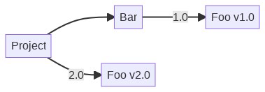
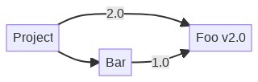
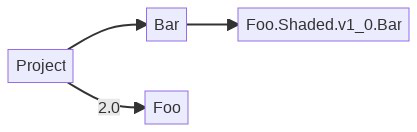
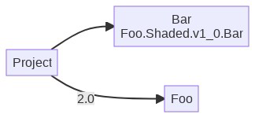

# Experiment: NuGet Package Shading

**Owner** [Mikayla Hutchinson](https://github.com/mhutch)

## Introduction

Producer-side package shading is an experimental feature that allows a NuGet package authors to "shade" a dependency: embed a renamed copy of it their package. This ensures that consumers of the package get the exact same version that the package author intended, regardless of any other direct or indirect references to that dependency.

The major downside to producer-side shading is that the shaded assemblies are included in the app even when they are identical or completely compatible with other shaded or non-shaded copies of the same dependency. This forced redundancy is a problem for scenarios where app size and memory use is highly important such as mobile apps and client-side web apps, **so producer side shading is not intended to ever become non-experimental or recommended for general use**.

The preferred long-term solution is consumer-side shading, where shading is performed holistically for an app, where it shade packages only when necessary, and deduplicate compatible and identical shaded assemblies.

Producer-side shading uses same building blocks as consumer-side shading, but is substantially smaller in scope. Developing and releasing producer-side shading as an experimental feature allows us to build out and test some of the underlying mechanisms for consumer-side shading, while making shading functionality available to package authors who need it.

## Background
### Dependency unification

To understand why shading is needed, we must understand dependency unification and the problems it can cause.

NuGet only allows a single version of each package to be resolved in the package graph. When a project has multiple references to the same package, NuGet must *unify* them to a single version. This frequently happens with transitive references to common packages such as `Newtonsoft.Json`.

To demonstrate this, consider an example where a project references package `Foo v2.0` and package `Bar`, and `Bar` depends on `Foo v1.0`:

]

The project *transitively* depends on `Foo v1.0` and directly depends on `Foo v2.0`. A project cannot depend on multiple versions of the same package, because this would cause conflicts and ambiguity. NuGet must *unify* the two differently versioned Foo dependencies to a single version in the context of that project.

> **NOTE** Unification is independent for each project. All the direct and transitive dependencies for each project must be unified in the context of that project, but the result of unification is specific to that set of dependencies. Another project in the same solution with different dependencies and/or dependency versions may unify to different versions of the same dependencies.

NuGet performs unification based on the dependency versions defined in the referencing packages or projects. Dependency versions may be exact, an explicit range, or a simple version that implicitly means "equal to or greater than". In the above example, the `v1.0` dependency means `>= v1.0`, so it is compatible with `v2.0`, and NuGet can unify them:

]

 When different versions of a dependency cannot be unified, NuGet restore fails with errors that are often difficult to understand (`NU1605`, `NU1107`). These errors currently make up a majority of NuGet restore errors. In some cases unification is possible but not automatic, in which case a developer may opt in by adding a direct reference to the dependency, but this is not straightforward.

When unification takes places, it often works fine. However, when references are incorrectly unified (i.e. they are not not actually compatible), this can result compiler errors, runtime errors, and behavioral differences. Runtime errors and behavioral errors in particular can be extremely difficult to find and diagnose. They may only be observed in production, and it may not be clear where they originate. These kinds of issues are often not attributed to NuGet, so NuGet unification issues likely represent a much bigger problem than the restore error codes would indicate.

### Impact on package authors

Unification problems create issues for package authors, not just consumers:

* Package consumers may be averse to install or update a reference to a package if it depends on another package used in their app, as it may cause unification errors or force them to The two versions may unify but are no longer fully compatible, it will cause problems elsewhere in their app.
* Package consumers may not be able to install or update a reference to a package if it depends on a package that their project already dependencs on. package used in their project and the references cannot be unified.
* Unifiication-related bugs may manifest in an application ways that make them appear to be a bug in the referencing package.

As a result, some package authors avoid depending on other packages to avoid the risk of their consumers encountering unification problems, particularly if those other packages are widely used.

## Shading

To solve this problem, we will implement a mechanism called _dependency shading_.

When a dependency of a package is _shaded_, the dependency and its assets are renamed so that it does not conflict with any other copies of that dependency that are directly or transitively references by the referencing project.

]

]

]

 A package author may choose to shade a dependency, and if they do so, the dependency will effectively become invisible to consumers of the package. A shaded dependency's assets are embedded into the shading package in such a way that they do not conflict with any other copies of those assets in the consumer's graph. Any reference to the shaded assets in the referencing copy will always resolve to the exact copy of those assets that it embedded.

> NOTE: The terminology of dependency shading comes from [Maven's shade plugin](https://maven.apache.org/plugins/maven-shade-plugin/index.html), but similar concepts apply in other ecosystems such as "vendoring" in Go.

A major downside to shading is that an app will end up with multiple copies of the same library, even when those copies are compatible or identical. This is particularly problematic in mobile and WebAssembly where app size is important and significant effort has been invested to reduce app size. This solution should be considered an intermediate step towards a more complete, whole-app solution that is able to unify compatible shaded dependencies.

(intro and scenarios to be added)

## Concerns

Package shading is fundamentally inefficient. Loading multiple copies of the same library increases an app's download size and memory use, which is particularly problematic in mobile and client-side web applications. Mobile devices have limited memory and will terminate backgrounded applications if they use too much memory, and users may be reluctant to download an app if it's too large, particularly on client namespaces.

 users will be unhappy if a client side web page takes too long to load.

## Usage

### Package authors

A *package author* may enable shading on any package reference as long as its assets are configured such that it is effectively private, and as long as any transitive references to that package are via shaded package references. When they restore their project, its shaded package references will be substituted for renamed copies of those packages and their assets. When the project is packed, these renamed assets are bundled in the resulting package.

The package author can be confident that when their library is used in an app, it will use the bundled copy of the shaded dependencies, and will not be affected by any other versions of those dependencies used elsewhere in the app.

### Package consumers

Shading is superficially invisible to consumers of a package that has shaded dependencies. They may notice the shaded assets in the build logs or output directory, and their app size may increase, but they do not need to be aware that shading exists. From the consumer's perspective, a shaded dependency is no different than any other private asset.

## Behavior

The goal of this spec is to build a package shading mechanism that builds upon and extends NuGet's current functionality for handling package assets.

### Characteristics

A shaded package reference must have all of the following characteristics:

1. **It is not transitive**. It does not flow to projects that reference the
   project that contains the shaded package reference, nor is it a dependency of
   the package created by packing that project.
2. **Its runtime assets are treated as `CopyLocal`**. They are copied into the
   output directory of the project that contains the shaded package reference,
   and are packed into the package created by packing that project.
3. **Its runtime assets are renamed** such that
   they are specific to the referencing project. When the a package created from
   that project is consumed as a package reference, the renamed runtime assets
   must not collide with copies of those assets from any other shaded or
   unshaded package reference to the original package.
4. **References to its compile assets are not exposed** by the project that
   contains the shaded package reference. For example, public APIs in compile
   assets of that project must not use types from the shaded package's compile
   assets, as the shaded package's compile assets will not be available to
   projects that reference that project or the package created by packing it.

The only one of these characteristics that is specific to shaded package
references is runtime asset renaming. A project will already make a package
reference non-transitive if it only consumes [*private
assets*](https://docs.microsoft.com/en-us/nuget/consume-packages/package-references-in-project-files#controlling-dependency-assets)
from that reference. Validating that that references to a dependency's  compile
assets are not exposed would a useful way for projects to ensure they do not
expose implementation details. And bundling private assets is a [problem for authors of MSBuild tasks](https://til.cazzulino.com/msbuild/how-to-include-package-reference-files-in-your-nuget-package).

explain idea of building from primitives.

### Private assets

The concept of shading overlaps NuGet's existing concept of 
Both enable a project to consume assets from a package reference without
exposing it transitively.

Although a project can technically repackage private assets into its own package, this is only useful in certain scenarios such as packages containing MSBuild tasks and targets. A project should not repackage private assets from a dependency as compile-time and runtime assets in its own package, as they will collide with other copies of those assets in a referencing project.

Shading removes this limitation by renaming assets so that they can be repackaged without colliding with other copies. Shading can be seen as an extension to the concept of private assets. By treating it as such, we can reuse existing behavior and concepts.

Shading will be an option that can be enabled on *private package references*: any package reference where all assets consumed from the package are consumed as private assets, and the reference is not exposed transitively

A future proposal will explore making private package references a first class concept in NuGet that can be declared and validated in a  straighforward manner.

### Shaded packages

Shading is the process of creating a modified copy of a package and/or its assets that can be used without risk of conflicting or colliding with other versions of that package and their assets. The modified copy is a *shaded package* and has a new identity, the *shaded name*. The *shaded assets* in a shaded package have their identity changed to match the package's shaded name, and any internal references within the assets are *retargeted* to reflect the new identities.

 To maintain coherence within a package's assets and across package dependencies, shading is always performed on an entire package and its contents rather than only on individual assets or asset types.

A shaded package and the shading process that creates it are specific to the *shading context* of the project with the shaded package reference. A project may have multiple shaded package references, and those packages may depend in each other. If a shaded package depends on a package that is shaded in the same shading context, then the shading process must retarget the package's dependency and any references in its assets so that they target the shaded package and its assets.

Retargeting a dependency involves finding references in th any references in the package and its assets so that they refer to the shaded version of that dependency. For example, an assembly reference in an assembly asset's metadata table would be updated to reference the shaded version.

The shaded name is a mangled name specific to the shading context and is designed such that the shaded package's assets do not collide at runtime with assets from other shaded copies and from the original unshaded package.

The name mangling is an implementation detail, and although it is deterministic to allow for deterministic builds, it may change in future versions of the .NET SDK. Developers should not depend on the mangling format or specific mangled IDs outside of references created by the .NET SDK itself.

### Shade-on-restore

Shading will take place at restore time. For each project with package references that are marked as shaded, corresponding shaded packages will be created in the project's intermediate output directory, and the references will resolve to the shaded versions of the packages. For the purposes of everything outside restore, shaded assets will be no different than private assets.

Performing shading at restore time rather than pack time means that the project will use the shaded versions of its dependencies at development time. This will give a higher fidelity development experience for debugging and testing.

Keeping shading independent of NuGet pack also makes it applicable to plugin scenarios, where shading private dependencies can prevent conflict with other plugins loaded in the same host that reference different versions of those dependencies. Examples of this include PowerShell cmdlets and Visual Studio extensions.

### Rename safety

Renaming a package's assets so that multiple renamed versions can be used at runtime is not something that can be performed safely. Some assets may inherently have singleton behavior, and assets may embed the original name in ways that cannot automatically be detected and updated, for example when using reflection to load an assembly by name.

The shading tools will detect known unsafe patterns and warn when assets cannot be renamed safely, for example calls to [`AssemblyLoadContext.Load`](https://docs.microsoft.com/en-us/dotnet/api/system.runtime.loader.assemblyloadcontext.load?view=net-5.0) with values that cannot be determined statically. However, the shading tools will not be able to detect all problematic cases. Authors of packages with shaded dependencies are expected to test their package thoroughly and verify that it works correctly with shaded dependencies.

A particularly problematic case is when assets are not inherently unsafe, but are used by the consumer in an unsafe way. For example, types from a library with shaded dependencies may get serialized in a way that embeds a shaded shaded assembly's shaded ID into the serialization output. This is unlikely to occur in practice as  reflection based serialization of private fields is generally considered problematic, but it represents an example of the kinds of problems that cannot easily be detected automatically.

### Controlling shading

Shading will be controlled by a boolean parameter named `ShadePrivateAssets` will alter the behavior of NuGet restore in .NET SDK based projects. Any package reference for which `ShadePrivateAssets` is `true` will be shaded: replaced at restore time with a reference to a synthetic package created by copying the package and renaming it and its assets. The name of this parameter is based on the existing `PrivateAssets` package reference metadata that causes assets to be consumed by the project and not surfaced transitively to referencing packages. Certain types of private assets such as runtime libraries are embedded in any package created by running the Pack target on the project.

The `ShadePrivateAssets` parameter exists both as an MSBuild property and as MSBuild item metadata. The property defaults to an empty value, and the metadata defaults to the property value. Empty values are interpreted as `False`. The property can be used to set the behavior for all package references in a project, and the metadata can set or override the behavior for individual package reference items.

Shading will only be performed on private package references. Package references may be made private via setting the the existing `PrivateAssets`, `IncludeAssets` and `ExcludeAssets` package reference metadata such that compile-time assets and the package reference itself do not transitively escape the project that contains the private reference. Attempting to enable shading for non-private package references via MSBuild metadata will cause a restore error, and non-private package references ignore the MSBuild property.

> *NOTE:* Creating a private reference currently requires a deep understanding of `PrivateAssets`, `IncludeAssets` and `ExcludeAssets`. A future proposal will make it easier to mark a package reference as private and verify that types from private references are not surfaced in public API.

To allow deterministic builds, the assets in a synthetic shaded package are renamed using a deterministic ID created by mangling the name of the project and the original ID of the package: `__Shaded_{ProjectName}_{OriginalPackageId}`. The ID of the synthetic package is an internal implementation detail and may be subject to change, but this does not matter as it should never end up in any artifacts created from the project.

Only direct package references may be shaded. Shaded direct package references may be unified with transitive package references, but only when those transitive package references are transitive via other shaded package references.

TODO explain why direct only
