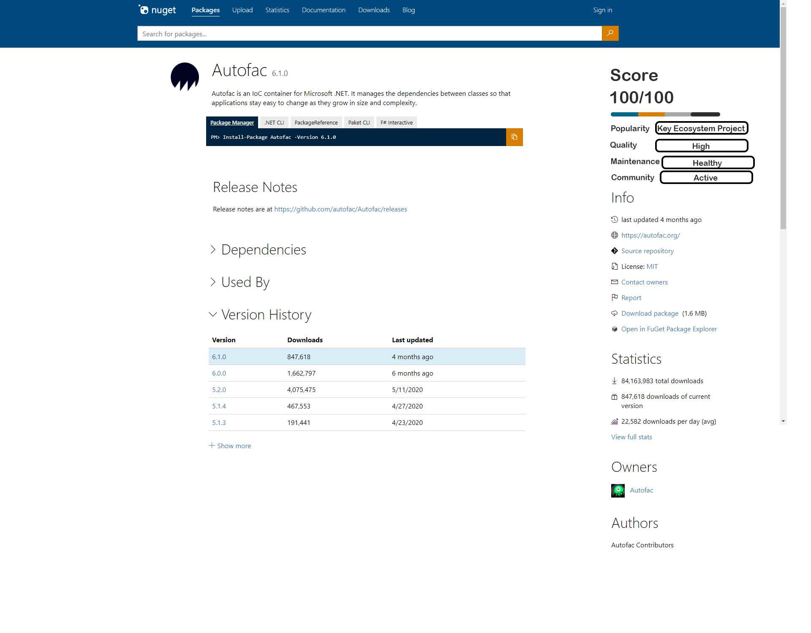
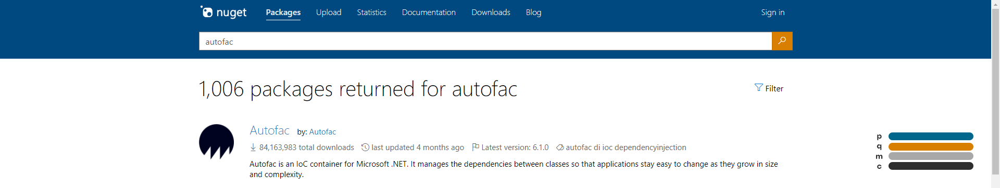
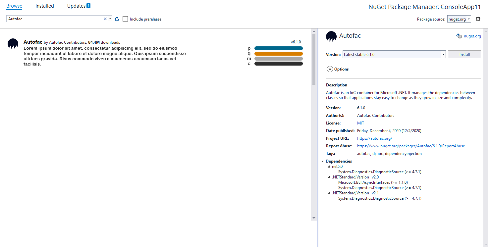
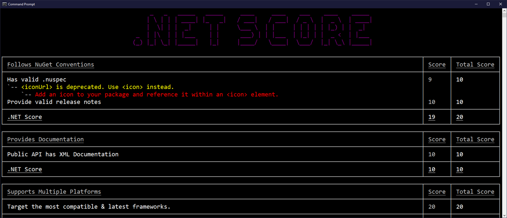

# Package Scoring (NET Score)

**Owner** [Jon Douglas](https://github.com/JonDouglas)

## Summary

<!-- One-paragraph description of the proposal. -->
With over 240,000 unique NuGet packages and over 3,000,000 package versions available to download, developers face an even harder challenge of being able to validate the quality of a package to be used in their projects.

There's many challenges to the quality of a package such as how many dependencies the package takes on, the amount of downloads the package has, and being maintained by a large company to name a few.

NuGet has many different types of packages such as frameworks, dependencies, tools, templates, and many more. With each package, there is metadata & package contents that are used to help define the overall package.

A high quality or "healthy" package is one that follows the following characteristics:

- **It is actively maintained.** Either with recent commits or an annual update/notice that the package is up-to-date.
- **It is documented.** It provides enough documentation to install, get started, and has public API documentation on it's members.
- **It has a way to report bugs.** It provides a centralized location or repository in which issues are regularly triaged & resolved in future releases.
- **It resolves security flaws quickly.** It fixes known vulnerabilities & releases an unaffected release quickly.
- **It is not deprecated.** It is in an active state meeting all the criteria above.

This is a small list of the many different characteristics that may make a package of high quality or "healthy".

Having packages of high quality that depend on other packages of high quality will make the overall software supply chain of higher quality and thus more secure & reliable for those using .NET tooling.

This proposal introduces the concept known as Package Scoring or NET Score for short.

## Motivation

<!-- Why are we doing this? What pain points does this solve? What is the expected outcome? -->

Developers are frustrated with the packages on NuGet meeting their needs. These needs are typically categorized in multiple categories:

1. **Popularity**- How popular a package is & recognized in the ecosystem.
2. **Quality** - The completeness of a package following best practices & providing documentation.
3. **Maintenance** - The state of maintenance & free of security vulnerabilities.
4. **Community** - The sustainability of an active community for the package.

There are a number of problems in each of these categories.

- **Popularity**
  - Number of downloads is used as a proxy to the overall quality of the package. 
    - If other people download it, that means it must be good!
  - Additional metrics should be added such as how many packages depend on the package. 
    - A network of what depends on the package may make it more practical to the ecosystem.
  - Popular packages may take on many dependencies that make a popular package “unhealthy”.
    - The more dependencies a popular package takes on & isn’t maintained, the higher likelihood more people become vulnerable from downloading it.
- **Quality**
  - High quality packages make the overall ecosystem higher quality.
    - High quality .NET tools and templates also improve the ecosystem.
  - There are no current best practices or validation checks of best practices for NuGet.
  - Package authors have little to no incentive to update their package unless a major issue is found (bug, security vulnerability, etc)
  - Documentation is often an afterthought and not surfaced in a direct way for a .NET user to see. They usually go straight to GitHub or the documentation pages.
  - Adoption of best practices & improved experiences are generally lower than expected.
- **Maintenance**
  - Regularly maintained packages avoid circular dependencies by taking on latest major versions of packages that are SemVer compatible. 
    - For diamond dependencies, a minor/patch version isn’t as breaking.
  - “Harm reduction” is an idea that people are going to do risky activities or be in risky situations and instead of saying “don’t be risky”, we can choose to help make those activities less risky by being proactive.
    - Let’s make maintainer’s lives easier to respond to and fix issues while encouraging community contribution.
- **Community**
  - Make it easier for someone to use a package with an abundance of documentation.
  - Clearly explain to someone how they might contribute to a package they use.
  - Demonstrate to people that packages are impactful, valuable, and have traction in the ecosystem.
  - Help package authors sustain their work by incentivizing their time with raising donations/funding.

There are also many **jobs-to-be done** when browsing for packages to use in projects or deciding to keep in your software supply chain. Here is a small list of jobs this concept will help developers with.

1. Determine whether a package is recognized by the ecosystem based on its **popularity and community** score.
2. Understand if a package is actively maintained or abandonded based on its **maintenance, quality, and community** score.
3. Prevent installing a package that contains a known vulnerability that has not yet been resolved based on it's **maintenance and quality** score.
4. See how they can get involved with the development of the package based on its **community** score.
5. Assess whether the package & its dependencies are compatible with the latest .NET Frameworks & tooling based on it's **quality** score.

The creation of a score for each of these categories and an overall score per package will help assess the health of the .NET Ecosystem & NuGet.

A developer for example can assess the score of a package to make a better decision as to if the package is worth including in their project. A team at a company might even take this score into their dependency policy to say they only accept a package score of 80 or above because they have stricter requirements.

## Concepts

**NuGet Gallery**

**Visual Studio**

**.NET CLI / Tool**

## Explanation

### Functional explanation

<!-- Explain the proposal as if it were already implemented and you're teaching it to another person. -->
<!-- Introduce new concepts, functional designs with real life examples, and low-fidelity mockups or  pseudocode to show how this proposal would look. -->
When a .NET developer creates a NuGet package and pushes it to NuGet.org, it will be scored on the following metrics totaling 25 points per category up to an overall score of 100.

**Popularity**:

- Total Weekly Downloads
- Number of Dependents
- Total GitHub Stars
- Total GitHub Forks
- Total GitHub Contributors

Based on these factors, this score can fall into a bucket that helps the user understand its popularity on NuGet such as “limited” or “key ecosystem project”.

**Quality**:

- Follow NuGet conventions
- Provides documentation
- Supports multiple platforms (if it can)
- Pass static analysis (reproducible builds, api compatibility, new feature adoption)
- Support up-to-date dependencies at creation time

Based on these factors, this score can fall into a bucket that helps the user understand its quality on NuGet such as “low” or “high”.

**Maintenance**:

- Open GitHub Issues
- Open GitHub PRs
- Last Release
- Last Commit
- No known security vulnerabilities
- Current license risk

Based on these factors, this score can fall into a bucket that helps the user understand its maintenance state on NuGet such as “unhealthy” or “healthy”.

**Community**:

- Code of Conduct
- Contributing
- Contributors
- Funding

Based on these factors, this score can fall into a bucket that helps the user understand its community on NuGet such as “inactive” or “active”.

**Note: This scoring criteria serves as a baseline and should be iterated in the open with the .NET ecosystem.**

<!--### Technical explanation-->

<!-- Explain the proposal in sufficient detail with implementation details, interaction models, and clarification of corner cases. -->

## Drawbacks

<!-- Why should we not do this? -->
Any set of quality rules will risk gaming the system. If a score was tied to the response time of an issue for example, you're giving package authors permission to frustrate their users in order to maintain a high score.

By having a set of rules, we must find consensus based on a committee of respected voices in the .NET ecosystem. This should include maintainers of the most influential projects, project leads or PMs of key ecosystem .NET projects, and the NuGet team to help determine these set of rules in order to establish a scoring concept.

Although there will always exist something that can be gamed, we want to reduce the potential of gaming by setting reasonable thresholds or optimal stops to achieve the maximum score per category to ensure a fair and achievable scoring system.

Package scoring will require an automation to assess a package's quality or "health". This is a long-tail problem that will require tooling after pack / pre-publishing and when packages are being uploaded/ingested to NuGet.org.

**How this will be successful:**

- Creating a committee of respected voices in the .NET ecosystem.
- Defining the overall scoring concept in the open & with collaboration by the OSS community.
- Automating the experience for package creation & consumption.
- Generating social proof & getting people excited about it.

## Rationale and alternatives

<!-- Why is this the best design compared to other designs? -->
<!-- What other designs have been considered and why weren't they chosen? -->
<!-- What is the impact of not doing this? -->
We have [ran multiple surveys & interviewed hundreds of .NET developers using NuGet](https://devblogs.microsoft.com/nuget/state-of-the-nuget-ecosystem/). The lowest satisfaction are in themes in which package scoring would benefit both package authors & package consumers while also increasing supply chain security. The top 3 themes for (~600) NuGet.org users were:

1. It's hard to tell if a package is of high quality and actively maintained. (5.27 Score)
2. It has insufficient package documentation (i.e. Readme, changelog, examples, API reference). (4.81 Score)
3. It is hard to tell if a package is secure. (4.61 Score)

While the satisfaction for the package ecosystem had the top 3 package themes:

1. Critical packages I need do exist, but they aren't maintained. (47%)
2. Critical packages I need do exist but they are not well documented. (45%)
3. Critical packages I need do exist, but they have dependency issues. (33%)

When browsing packages, the lowest satisfaction was in the following areas:

- Knowing the overall quality of a package (4.15)
- Seeing enough details about a package (4.71)

This problem exists in many other developer ecosystems as to what inspired much of the ["shift left movement"](https://www.linuxfoundation.org/wp-content/uploads/oss_supply_chain_security.pdf) based on catastrophic security incidents in which packages are compromised by typosquatting, account takeover, package deletion, highjacking, and backdooring. The practices that developers must take on to avoid these incidents can range from having 2FA enabled, use of source control, following [Semantic Versioning](https://semver.org/), including tests, documenting dependencies, signing packages, and tracking known security vulnerabilities to resolution.

While NuGet follows many of these best security practices, we believe that package managers like NuGet can be improved to benefit authors & consumers to make better trust decisions of packages on the central repository (NuGet.org) such as:

- Package has no known security or reliability issues.
- Package does not contain any unexpected or malicious behavior.
- Package does not have a misleading name that suggests typosquatting or impersonation.

Although there's no solution to meet all needs, we hope that package scoring can help further improve the understanding of:

- It being difficult to determine if software is trustworthy because of a lack of agree-upon understanding as to what it means for software to in fact be "trustworthy" and because of a lack of effective tooling.
- It is challenging to determine if download locations such as repositories are trustworthy.
- Users often failing to ensure that the software they request is the software in fact the package they believe to be and not a malicious, fradulent, or otherwise incorrect package.
- Users often failing to verify that the software they did receive is the software they wanted by such as checking digital signatures, auditing/receipts of sources, and performing security or quality checks ahead of time.

Needless to say, many of the issues that exist for NuGet today could be dampened with the introduction of a scoring system. The score should provide more than enough information for an individual to make a clear trust decision with.

**Why?**
- The .NET ecosystem can be improved.
- This isn't just a feeling; this is a way we can measure the ecosystem.
- It's not a technical problem, it's more of a social one.
- The functional solution will not be to change how packages are published, but how packages are selected for use.
- The solution needs to account not only the package, but the whole software supply chain of the package (direct & indirect dependencies, SDK, licenses, etc).

**Survey & Reports**:

- https://devblogs.microsoft.com/nuget/state-of-the-nuget-ecosystem/
- https://github.com/dotnet-foundation/ecosystem-growth/blob/main/docs/oss-sustainability.pptx
- https://octoverse.github.com/
- https://www.linuxfoundation.org/wp-content/uploads/oss_supply_chain_security.pdf
- https://blog.golang.org/survey2020-results
- https://medium.com/flutter/what-do-flutter-package-users-need-6ecba57ed1d6

## Milestones

- Milestone 1 - Collaborating with the .NET ecosystem to get consensus on what makes a well-rounded & transparent score.
- Milestone 2 - Proof of concept for scoring packages prior to publishing. (dotnet tool / pack tooling)
- Milestone 3 - NuGet.org ingestion of package scores & displaying them in search results & package details.
- Milestone 4 - Visual Studio & dotnet CLI integrations displaying scores & score tooling providing users `--dry-run` or `--score` prior to push.

## Prior Art

<!-- What prior art, both good and bad are related to this proposal? -->
<!-- Do other features exist in other ecosystems and what experience have their community had? -->
<!-- What lessons from other communities can we learn from? -->
<!-- Are there any resources that are relevent to this proposal? -->
- [npm searching for and choosing packages to download](https://docs.npmjs.com/searching-for-and-choosing-packages-to-download)
- [npms analyzer](https://npms.io/about)
- [pub.dev scoring](https://pub.dev/help/scoring)
- [pub.dev pana](https://github.com/dart-lang/pana)
- [snyk advisor](https://snyk.io/advisor/)
- [Go best practices](https://go.dev/about#best-practices-h2)
- [Google Best Practices for Java Libraries](https://jlbp.dev/)
- [.NET Foundation Project Eligibility Criteria](https://github.com/dotnet-foundation/projects#eligibility-criteria)
- [.NET Foundation Project Maturity Model](https://github.com/dotnet-foundation/project-maturity-model/blob/master/maturity-profiles.md)

## Unresolved Questions

<!-- What parts of the proposal do you expect to resolve before this gets accepted? -->
<!-- What parts of the proposal need to be resolved before the proposal is stabilized? -->
<!-- What related issues would you consider out of scope for this proposal but can be addressed in the future? -->
- How tightly coupled should the package scoring concept be with GitHub or other open source ecosystems like GitLab/BitBucket/etc?
- Does security concerns warrant it's own category such as **security**?
- Should this concept work for private feeds or only the central feed?

## Future Possibilities

<!-- What future possibilities can you think of that this proposal would help with? -->
- The .NET ecosystem can use exposed score APIs & metadata to create new tooling & experiences with.
- [Reproducible builds](https://github.com/dotnet/reproducible-builds) can be checked as part of the score.
- [Package validation](https://github.com/dotnet/designs/pull/196) can be checked as part of the score.
- Scoring can be iterated and improved in future versions as we learn more about the overall health of the .NET ecosystem.