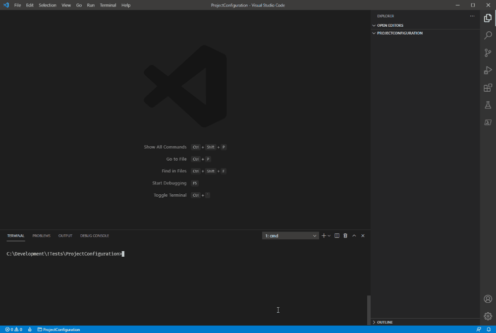
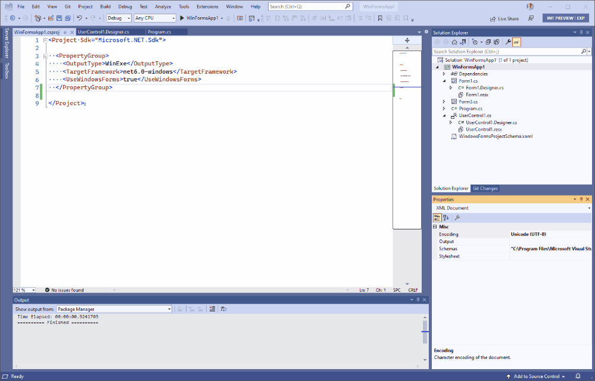
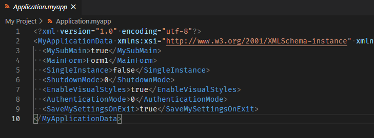
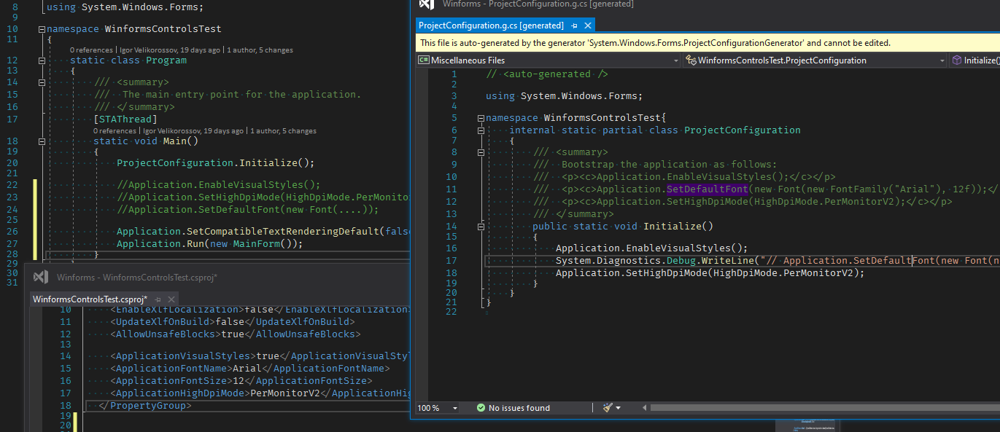
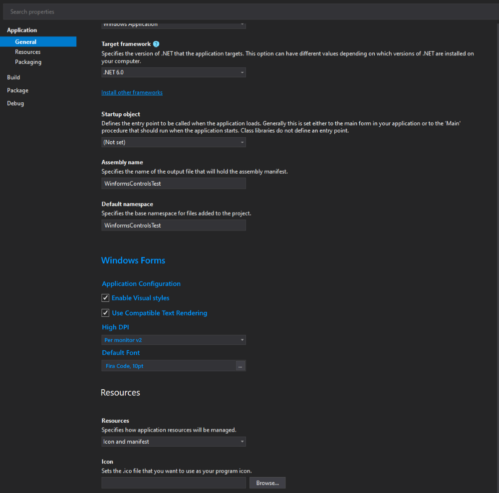

# Streamline Windows Forms application configuration and bootstrap 

<!--
Provide the primary contacts here. Linking to the GitHub profiles is useful
because it allows tagging folks on GitHub and discover alternative modes of
communication, such as email or Twitter, if the person chooses to disclose that
information.

The bolded roles makes it easier for people to understand who the driver of the
proposal is (PM) and who can be asked for technical questions (Dev). At
Microsoft, these roles happen to match to job titles too, but that's irrelevant.
-->

**Owner** [Igor Velikorossov](https://github.com/RussKie)

# Overview

Historically Windows Forms designer was rendering its design surface based on hardcoded assumptions, such as control default font and dpi settings. However over the past 10-15 years not only multi-monitor configurations became a norm, monitor tech has made significant progress in making 4K, 5K, 8K, etc. monitors widely used by our consumers. The Windows itself has been innovating and tinkering with UI configurations, such default font metrics (which over the years deviated from "Microsoft Sans Serif, 8pt" to "Segoe UI, 9pt"). Incidentally the office team is currently [in search of the next default font](https://www.microsoft.com/en-us/microsoft-365/blog/2021/04/28/beyond-calibri-finding-microsofts-next-default-font/), and Windows 11 may have yet another default font too.

The .NET Core/.NET-powered Windows Forms runtime has been (more or less) keeping up with the changes, e.g. by providing new API to [set high dpi mode](https://github.com/dotnet/winforms/pull/396), or by updating the [default font](https://github.com/dotnet/winforms/pull/656). The default font change has unearthed numerous issues in the runtime (e.g. different font-based scaling), which we addressed by providing (yet another) API to set an [application-wide default font](https://github.com/dotnet/winforms/pull/4911). 

However during numerous discussions the team has identified probably the biggest flaw in the current separation of the runtime and the designer, and the overall move from .NET Framework assumptions - the lack of a mechanism to share Windows Forms project-level configuration settings between the runtime and the designer. That is, if the app is configured to run with disabled visual styles, in PerMonitorV2, and have an application-wide default font set to "Arial, 14pt" there is no way to show the designer surface with the same settings to truly provide the WYSIWYG experience.


# Proposal

The purpose of this proposal is to:

1. **streamline a Windows Forms application configuration and bootstrap**, 
2. with the view that this will facilitate the **sharing of the information between the runtime and the designer during the development phase**.<br/>
That is, whenever the designers surface process is started configuration information is read from a known location, and necessary configurations are applied (e.g. run the design surface in PerMonitorV2 mode, or set a form/usercontrol default font to "Arial, 14pt").

**NOTE:** The new functionality is opt-in, i.e. unless a developer makes a conscious decision to use the new configuration and the bootstrap mechanism existing applications will continue to work as-is, and the current developer experience will remain the same.


## Scenarios and User Experience

<!--
Provide examples of how a user would use your feature. Pick typical scenarios
first and more advanced scenarios later.

Ensure to include the "happy path" which covers what you expect will satisfy the
vast majority of your customer's needs. Then, go into more details and allow
covering more advanced scenarios. Well designed features will have a progressive
curve, meaning the effort is proportional to how advanced the scenario is. By
listing easy things first and more advanced scenarios later, you allow your
readers to follow this curve. That makes it easier to judge whether your feature
has the right balance.

Make sure your scenarios are written in such a way that they cover sensible end-
to-end scenarios for the customer. Often, your feature will only cover one
aspect of an end-to-end scenario, but your description should lead up to your
feature and (if it's not the end result) mention what the next steps are. This
allows readers to understand the larger picture and how your feature fits in.

If you design APIs or command line tools, ensure to include some sample code on
how your feature will be invoked. If you design UI, ensure to include some
mock-ups. Do not strive for completeness here -- the goal of this section isn't
to provide a specification but to give readers an impression of your feature and
the look & feel of it. Less is more.
-->

Refer to [Design](#Design) section below.

* Runtime:<br/>
  

* Design time<br />
  


## Requirements

### Goals

<!--
Provide a bullet point list of aspects that your feature has to satisfy. This
includes functional and non-functional requirements. The goal is to define what
your feature has to deliver to be considered correct.

You should avoid splitting this into various product stages (like MVP, crawl,
walk, run) because that usually indicates that your proposal tries to cover too
much detail. Keep it high-level, but try to paint a picture of what done looks
like. The design section can establish an execution order.
-->

1. The new bootstrap experience (this includes source generators and analyzers) must come inbox with the Windows Desktop SDK, and be available without any additional references or NuGet packages from get go (i.e. `dotnet new winforms && dotnet build`).<br/>Related: [dotnet/designs#181](https://github.com/dotnet/designs/pull/181)

2. The shared configuration must be stored in a way that is easily accessible to the Widnows Forms Designer and Windows Forms runtime. And this storage mechanism must not have any adverse effect on the perfomance of the Designer, i.e. not require any additional computation, unless absolutely necessary.

3. The shared configuration must work for single project and multi project scenarios, i.e. for scenarios where 
    - the application entry point (i.e. `Main()`) and all user forms and controls reside in the same project, and
    - the application entry point (i.e. `Main()`) resides in one project, and user forms and controls either reside in other projects within the solution or referenced via NuGet packages.

3. The configuration defaults must be chosen such that the original code in `Main()` could be replaced with the new bootstrap call, and no further configuration would be required.

3. The Windows Forms application template must be updated with the new bootstrap experiece.

### Stretch Goals

1. Update Visual Studio property page for Windows Forms projects.
2. Build the following Roslyn Analyzers functions:

    * Check for invocations of now-redundant `Applicaiton.*` methods invoked by `ApplicationConfiguration.Initialize()`.
    * If a custom app.manifest is specified, parse it, and if dpi-related settings are found - warn the user, and direct to supply the dpi mode via the MSBuild property defined below.
    * (Consider) checking for app.config and dpi-related configurations, if found - warn the user, and direct to supply the dpi mode via the MSBuild property defined below.
    * Check if `Application.SetHighDpiMode()` is invoked with anything other than `HighDpiMode.SystemAware` (see: [dotnet/winforms-designer#3278](https://github.com/dotnet/winforms-designer/issues/3278))

3. Update the Windows Forms application template using the top level statements syntax.


### Non-Goals

<!--
Provide a bullet point list of aspects that your feature does not need to do.
The goal of this section is to cover problems that people might think you're
trying to solve but deliberately would like to scope out. You'll likely add
bullets to this section based on early feedback and reviews where requirements
are brought that you need to scope out.
-->

1. Provide source generator/analyzer support for apps built on .NET Framework, .NET Core 3.1, or .NET 5.0.

1. Design/implement top level statements fo Windows Forms applications. Tracked under: [dotnet/winforms#5074](https://github.com/dotnet/winforms/issues/5074)
1. Design/implement new host/builder model for Windows Forms applications.
1. Migrate Visual Basic apps off the Application Framework or change the use of *.myapp file.
1. Streamline the bootstrap of Visual Basic apps or use Roslyn source generators for this purpose.
1. Use Roslyn analyzers in Visual Basic scenarios until previous two items are addressed.
1. Provide a mechanism to configure locale aware font descriptors.
1. Provide a mechanism to configure fonts that are vertical or require custom GDI charsets, or are part of `SystemFonts` collection.


:thinking: In the future releases of .NET (e.g. 7.0+) we will consider how to migrate Visual Basic off the Application Framework and *.myapp file in favour of Roslyn source generators and MSBuild properties. This could also significantly reduce efforts in maintaining Visual Studio property pages for Visual Basic projects (e.g. [dotnet/project-system#7236](https://github.com/dotnet/project-system/issues/7236), [dotnet/project-system#7240](https://github.com/dotnet/project-system/issues/7240), and [dotnet/project-system#7241](https://github.com/dotnet/project-system/issues/7241))


## Stakeholders and Reviewers

<!--
We noticed that even in the cases where we have specs, we sometimes surprise key
stakeholders because we didn't pro-actively involve them in the initial reviews
and early design process.

Please take a moment and add a bullet point list of teams and individuals you
think should be involved in the design process and ensure they are involved
(which might mean being tagged on GitHub issues, invited to meetings, or sent
early drafts).
-->

* Windows Forms runtime/designer: @dotnet/dotnet-winforms @OliaG @DustinCampbell 
* Visual Basic: @KathleenDollard  @KlausLoeffelmann
* Roslyn: @jaredpar @sharwell
* Project System: @drewnoakes 
* SDK: dsplaisted 
* .NET libraries: @ericstj
* General: @terrajobst @Pilchie 

## Design

<!--
This section will likely have various subheadings. The structure is completely
up to you and your engineering team. It doesn't need to be complete; the goal is
to provide enough information so that the engineering team can build the
feature.

If you're building an API, you should include the API surface, for example
assembly names, type names, method signatures etc. If you're building command
line tools, you likely want to list all commands and options. If you're building
UI, you likely want to show the screens and intended flow.

In many cases embedding the information here might not be viable because the
document format isn't text (for instance, because it's an Excel document or in a
PowerPoint deck). Add links here. Ideally, those documents live next to this
document.
-->


### 1. Visual Basic 

Ironically Visual Basic apps are in a good position for the designer integration with their Application Framework functionality, i.e. "*.myapp" file:



The designer surface process should have no issues reading configuration values from a myapp file. Any work further work at this stage pertaining for streamlining the bootstrap is out of scope of this design proposal.


### 2. C#


#### Affected API

```diff
    static class Program
    {
        [STAThread]
        static void Main()
        {
+           ApplicationConfiguration.Initialize();

-           Application.EnableVisualStyles();
-           Application.SetCompatibleTextRenderingDefault(false);
-           Application.SetDefaultFont(new Font(....));
-           Application.SetHighDpiMode(HighDpiMode.SystemAware);

            Application.Run(new MainForm());
       }
    }
```

#### MSBuild properties

New properties:

```diff
// proj

  <PropertyGroup>
     <ApplicationIcon />
     <ApplicationManifest>app1.manifest</ApplicationManifest>

+    <!--
+       Purpose: controls whether to emit: Application.EnableVisualStyles();
+       Default=true
+       Empty value=true
+     -->
+    <ApplicationVisualStyles>[true|false]</ApplicationVisualStyles>

+    <!--
+       Purpose: the value in: Application.SetCompatibleTextRenderingDefault(...);
+       Default=false
+       Empty value=false
+     -->
+    <ApplicationUseCompatibleTextRendering>[true|false]</ApplicationUseCompatibleTextRendering>

+    <!--
+       Purpose: contains a custom font information; controls whether to emit: Application.SetDefaultFont(new Font(....));
+       Default=''
+       Empty value='', implies Control.DefaultFont
+     -->
+    <ApplicationFont>[equivalent to Font.ToString()]</ApplicationFontName>


+    <!--
+       Purpose: the value in: Application.SetHighDpiMode(...);
+       Default=SystemAware
+       Empty value=SystemAware
+     -->
+    <ApplicationHighDpiMode>[string/HighDpiMode enum value]</ApplicationHighDpiMode>
  </PropertyGroup>
```

Existing properties of interest:

```xml
// proj

  <PropertyGroup>
    <OutputType>WinExe</OutputType>
    <ApplicationManifest>[manifest file, optional, default='']</ApplicationManifest>
  </PropertyGroup>
```

### Implementation details

1. The new bootstrap API must only work for Windows applications projects (i.e. `OutputType = WinExe` and [`OutputType = Exe`](https://docs.microsoft.com/dotnet/core/compatibility/sdk/5.0/automatically-infer-winexe-output-type)) because:
    - These projects have an entry point, where an app is initialised; and
    - they also specify an application manifest, if there is one.

    During compilation Roslyn source generators will read supplied configurations, and emit code for the necessary API, e.g.<br/>
:warning: The screenshot is dated, provided for concept demonstration purposes only:<br />



2. There are multiple possible places for storing values that must be accessible to the Designer, and the Designer must be able to read these values quickly and efficiently. The contenders are:

    <table>
      <tr>
        <th width="15%"></th>
        <th width="40%"><center>Pros</center></th>
        <th width="40%"><center>Cons</center></th>
      </tr>
      <tr>
        <td>Csproj/props (vbproj in the long run)</td>
        <td>
          <ul>
            <li>Easy to add/modify</li>
            <li>Accessible to all projects in the solution (multi project scenario)</li>
            <li>Can be overriden at a project level (multi project scenario)</li>
            <li>Easy to expose in the Visual Studio project settings UI</li>
          </ul>
        </td>
        <td>
          <ul>
            <li><i>"After all we’ve done to clean up project files, it feels like a regression to add properties that don’t need to be there. MSBuild files are already hard enough for many users to understand, and we won’t be helping by putting values there that doesn’t really make sense to be there."</i></li>
          </ul>
        </td>
      </tr>
      <tr>
        <td>Code (presumably in WinExe) as a known to the designer method (akin to <code>InitializeComponent()</code>) or attributes</td>
        <td>
          <ul>
            <li>Generally familiar model to C# devs</li>
          </ul>
        </td>
        <td>
          <ul>
            <li>Won't work in multi project scenarios</li>
            <li>Likely have an adverse effect on the designer start up - the designer needs to load and parse the method/attributes data</li>
            <li>Very difficult to expose in the Visual Studio project settings UI</li>
          </ul>
        </td>
      </tr>
      <tr>
        <td>app.json/project.json/app.config/etc.</td>
        <td>
          <ul>
            <li>Easy to add/modify</li>
            <li>Not "polluting" csproj/props with unrelated properties</li>
          </ul>
        </td>
        <td>
          <ul>
            <li>It is an anti-pattern, we shouldn't inventing new files because we don’t want to clutter the project files.</li>
            <li>Configs may not be accessible to all projects in the solution (multi project scenario)</li>
            <li>app.config don't appear to be used in .NET, and our templates no longer carry one</li>
            <li>May be difficult to expose in the Visual Studio project settings UI</li>
          </ul>
        </td>
      </tr>
      <tr>
        <td>.editorconfig</td>
        <td>
          <ul>
            <li>Easy to add/modify</li>
            <li>Accessible to all projects in the solution (multi project scenario)</li>
            <li>There is  an existing Visual Studio UI</li>
          </ul>
        </td>
        <td>
          <ul>
            <li>The proposed configuration is not a style configuration, nor exclusive to design-time (for WinExe, though is for control libraries)</li>
          </ul>
        </td>
      </tr>
    </table>

    After a number of discussions, it was concluded that MSBuild properties (i.e. csproj/props) is the best mechanism for storing settings. The concerns with polluting project files can be addressed with sensible defaults, that is a "zero configuration" must work for the main stream scenarios, and ultimately produce the same code being replaced:

    ```diff
        static class Program
        {
            [STAThread]
            static void Main()
            {
    +           ApplicationConfiguration.Initialize();

    -           Application.EnableVisualStyles();                       // ApplicationVisualStyles='' or true
    -           Application.SetCompatibleTextRenderingDefault(false);   // ApplicationUseCompatibleTextRendering='' or false
    -           Application.SetHighDpiMode(HighDpiMode.SystemAware);    // ApplicationHighDpiMode='' or SystemAware

    -           Application.SetDefaultFont(new Font(....));             // New in .NET 6.0 Preview5
    -                                                                   //    ApplicationFont='' -> Control.DefaultFont

                Application.Run(new MainForm());
           }
        }
    ```

3. We will be able to leverage the power of Roslyn analyzers to warn developers about duplicate/redundant API invocations performed outside the generated code, unnecessary DPI settings in the app.manifest (inspecting `ApplicationManifest` property), and generally steer them towards the new bootstrap experience.


### 3. Visual Studio: designer

The designer will respect the custom configurations (font for now, other may follow), and render the design surface with required metrics.

Tracked under [dotnet/winforms-designer#3192](https://github.com/dotnet/winforms-designer/issues/3192) and [dotnet/winforms-designer#3509](https://github.com/dotnet/winforms-designer/pull/3509).

### 4. Visual Studio: project system 

To complete the user experience we can update the Visual Studio property page for C# Windows Forms projects, and provide an Application Framework-esque (yet arguably more refined) experience to C# developers. It can looks something like this mockup:




Tracked under [dotnet/project-system#7279](https://github.com/dotnet/project-system/issues/7279)


## Q & A

<!--
Features evolve and decisions are being made along the road. Add the question
as a subheading and provide the explanation for the decision below. This way,
you can easily link to specific questions.

When you find yourself having to explain something in a GitHub discussion or in
email, consider to update your proposal and link to your answer instead. This
way, you avoid having to explain the same thing over and over again.
-->

### Why store settings as MSBuild properties (e.g. in csproj or props files)?


After deliberations and discussions we propose the settings to be stored as MSBuild properties for the following reasons:

- The Windows Forms designer run in Visual Studio and able to read MSBuild properties.
- Unlike schema-enforced app.config, MSBuild properties are stored in an untyped propertybag.
- app.configs don't appear to be used in .NET apps.
- Whilst developers who build their apps on .NET Framework 4.7+ maybe familiar with [app.config ApplicationConfigurationSection](https://docs.microsoft.com/dotnet/framework/configure-apps/file-schema/winforms/windows-forms-add-configuration-element) and/or [app.config AppContextSwitchOverrides](https://docs.microsoft.com/dotnet/framework/configure-apps/file-schema/runtime/appcontextswitchoverrides-element), we have removed all dependencies on app.config and these quirks in .NET Core 3.0 timeframe.
  > :thought_balloon:  It is also worth noting that quirks were necessary in .NET Framework, which was installed in-place, and didn't provided any kind of side-by-side deployment. In a rare and unfortunate event where we may accidentally break end users experiences in a given release users will be able to install a previous working .NET release and run their application against it until a fix becomes available.
- There may also be an argument that app.config can be changed by end users, thus allowing to alter behaviours of applications without a recompilation, making the app.config the prefered configuration vehicle. But it is important to note that our SDK is built with developers in mind, and not the ability of end users to alter the application behaviours at will. If an app developer feels it is important to allow end users to change the default font or dpi settings via an app.config it is the developers responsibility to facilitate that mechanism to end users.


### Font Configuration

#### Default scenario

Initial thinking was to allow configuration of only [`Font.FamilyName`](https://docs.microsoft.com/dotnet/api/system.drawing.font.fontfamily) and [`Font.Size`](https://docs.microsoft.com/dotnet/api/system.drawing.font.size) properties. However these two properties may be insufficient in some use cases, which otherwise would be achievable if `Application.SetDefaultFont(Font)` API was invoked manually.
E.g.:

```cs
Application.SetDefaultFont(new Font(new FontFamily("Calibri"), 11f, FontStyle.Italic | FontStyle.Bold, GraphicsUnit.Point));
```

It would rather be impractical to provide an MSBuild properties for each argument the `Font` constructor takes, and instead the proposal is to configure fonts via a single property `ApplicationFont`. This property will have a format equivalent to the output of [`FontConverter.ConvertToInvariantString()` API](https://github.com/dotnet/runtime/blob/00ee1c18715723e62484c9bc8a14f517455fc3b3/src/libraries/System.Drawing.Common/src/System/Drawing/FontConverter.cs#L29-L86) e.g.: 

```
name, size[units[, style=style1[, style2, ...]]]
```

#### Locale aware font configuration

It is theoretically possible that [`Font.FamilyName`](https://docs.microsoft.com/dotnet/api/system.drawing.font.fontfamily) may be locale sensitive, i.e. a different font family (and size) could be used in different regions of the world. However I was unable to find any real world scenarios or solicit user feedback. We may consider providing an implementation supporting this use case when such scenario will be made available to us.

#### Error scenarios

Runtime:
* If the value of `ApplicationFont` resource can't  be parsed, this will result in a compilation error.
* If the font name supplied in the `ApplicationFont` value is invalid, this will result in a runtime error.

Designer:
* If the value of `ApplicationFont` resource can't  be parsed, this will result in the designer process load failure.
* If the font name supplied in the `ApplicationFont` value is invalid, this will result in the designer process load failure.


### How to resolve dpi settings?

At this point an astute Windows Forms developer will say that there are currently 3 different ways to configure dpi settings (which may or may not be mutually exclusive or complimentary):
* [app.manifest](https://docs.microsoft.com/windows/win32/sbscs/application-manifests) - Common Control related configuration, dealing with it was always a pain. Very likely that a significant part of Windows Forms developers have never heard of it.
* [app.config ApplicationConfigurationSection](https://docs.microsoft.com/dotnet/framework/configure-apps/file-schema/winforms/windows-forms-add-configuration-element) and [app.config AppContextSwitchOverrides](https://docs.microsoft.com/dotnet/framework/configure-apps/file-schema/runtime/appcontextswitchoverrides-element).
* [`Application.SetHighDpiMode(HighDpiMode)`](https://docs.microsoft.com/dotnet/api/system.windows.forms.application.sethighdpimode).

This proposal introduces a 4th way of configuring dpi, and to make it successful it has to (paraphrasing JRR Tolkien):


> _One API to rule them all, One API to find them,_<br/>
> _One API to bring them all and in the ApplicationConfiguration bind them..._


The benefit the new approach provides is by facilitating the sharing of the information between the runtime and the designer during the development phase, as well as unifying how dpi settings are configured. This benefit is believed to outweigh the need to remove several lines of code from `Main()` method and adding several MSBuild properties.

### What about top level programs and host/builder model?

Generally speaking, this proposal is orthogonal to top level programs. Windows Forms applications can already be written as top level programs today, e.g.:
```cs
using System.Drawing;
using System.Threading;
using System.Windows.Forms;
using ProjectConfiguration;

// Apartment must be set to Unknown first.
Thread.CurrentThread.SetApartmentState(ApartmentState.Unknown);
Thread.CurrentThread.SetApartmentState(ApartmentState.STA);

Application.EnableVisualStyles();
Application.SetCompatibleTextRenderingDefault(defaultValue: false);
Application.SetDefaultFont(new Font(new FontFamily("Arial"), 12f));
Application.SetHighDpiMode(HighDpiMode.SystemAware);

Application.Run(new Form1());
```

In the long term we could consider supporting a host/builder model, similar to the suggestion in [dotnet/winforms#2861](https://github.com/dotnet/winforms/issues/2861) and implementation in [alex-oswald/WindowsFormsLifetime](https://github.com/alex-oswald/WindowsFormsLifetime). E.g.:
```cs
[main: STAThread]
CreateHostBuilder().Build().Run();

public static IHostBuilder CreateHostBuilder() =>
    Host.CreateDefaultBuilder(Array.Empty<string>())
        .UseWindowsFormsLifetime<Form1>(options =>
        {
            options.HighDpiMode = HighDpiMode.SystemAware;
            options.EnableVisualStyles = true;
            options.CompatibleTextRenderingDefault = false;
            options.SuppressStatusMessages = false;
            options.EnableConsoleShutdown = true;
        })
        .ConfigureServices((hostContext, services) =>
        {
            // ...
        });
```

However we need to be congnisant of the fact that Windows Forms apps often have elaborate application bootstrap logic (e.g. [this](https://github.com/gitextensions/gitextensions/blob/master/GitExtensions/Program.cs), [this](https://github.com/luisolivos/Halconet/blob/4ed328a15ba69aab00e92076774977143790b5d3/HalcoNET%205.8.0/Ventas/Program.cs), or [this](https://github.com/aaraujo2019/PEQMIMERIA/blob/e11b6d57e3bbbe505834cbfeb717fe87066d6850/DBMETAL_SHARP/DBMETAL_SHARP/Program.cs)) that could be difficult to translate or adapt to this syntax, so this direction will require deeper investigations and feasibility studies.


### Does this approach align/conflict with other UI SDKs, e.g. WPF or WinUI?

Other UI SDKs (e.g. WPF and UWP) are XAML-based, and their designers read the same XAML files as their runtime, and run essentially the same app just in a different context (shell/window integration, app model). WinUI doesn't currently have a designer.
