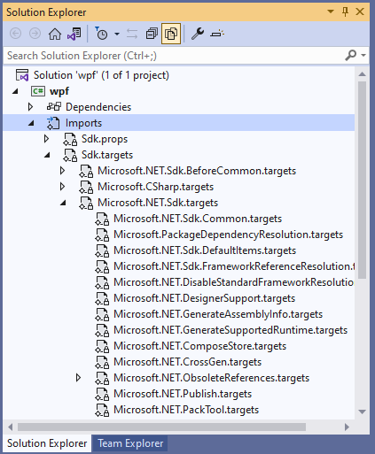

# .NET Workloads Target Import Ordering

**Owners** [Sarah Oslund](https://github.com/sfoslund) | [Daniel Plaisted](https://github.com/dsplaisted)

## Background

To support .NET SDK workloads, we [changed the order of targets imports](https://github.com/dotnet/sdk/pull/14393) to allow SDK workloads to change property defaults. When we did this, we also changed the import order of some Windows and WPF targets, as we want to make it a workload in the future, which caused a breaking change. It appears that it is not possible to allow workloads to change property defaults and make support for Windows a .NET SDK workload without introducing a breaking change. As a result, this document explores possible solutions to minimize the user impact.

### Original Ordering Change

Originally, the Windows, WindowsDesktop, and workload targets were imported at the end of `Microsoft.NET.Sdk.targets`, which was almost the last files imported.  However, this was not an appropriate place for the imports if those targets were to override default property values that were set in .NET SDK or MSBuild common targets.  The workload needs a chance to set the property if its not already set before the default logic would do so.

Because of this, the workload targets import [was moved](https://github.com/dotnet/sdk/pull/14393) to come after the target framework parsing.  This is because whether a workload is used (and hence needs to be imported) may depend on the target framework or platform, so those conditions should go after the `TargetFramework` has been parsed into the corresponding component properties (`TargetFrameworkIdentifier`, `TargetFrameworkVersion`, `TargetPlatformIdentifier`, and `TargetPlatformVersion`).

The Windows and WindowsDesktop targets were moved together with the workload targets import, as we expect them to eventually become part of a workload.  However, this moved those imports before the import of `Directory.Build.targets`, which meant that properties set in that (such as `UseWPF` and `UseWindowsForms`) would no longer take effect.

This is an issue not just because it's a breaking change, but because it means that `Directory.Build.targets` can never be used to set a property that determines whether a workload is used.

### MSBuild Importing Context

#### MSBuild Evaluation

We are primarily concerned with "[Pass 1](https://github.com/dotnet/msbuild/blob/6f9e0d620718578aab8dafc439d4501339fa4810/src/Build/Evaluation/Evaluator.cs#L613)" of [MSBuild Evaluation](https://docs.microsoft.com/en-us/visualstudio/msbuild/build-process-overview#evaluation-phase), where properties are evaluated and project imports are loaded.

Some properties depend on other properties, so the order in which they are declared matters. For example, the default value for the `GenerateDependencyFile` property depends on the `TargetFrameworkIdentifier` property, which itself is derived from the `TargetFramework` property. So these declarations need to be evaluated in the correct order for the values to be set correctly.

Likewise, project imports (typically used to import `.targets` or `.props` files) can be conditioned on property values. So if WindowsDesktop targets are imported if `UseWPF` or `UseWindowsForms` is true, then those properties need to be set before the WindowsDesktop project import is evaluated.

The evaluation ordering of MSBuild targets is usually not important. The order that the targets are executed is determined by the dependencies between them, not by the order they come in evaluation. The exception to this is that you can override a target by defining another target with the same name later in evaluation.

#### Exploring Import Order

There are many `.props` and `.targets` files that get imported when building a .NET project. One way to see what is imported and in what order is by preprocessing a project, either with the `-pp:` [command line argument](https://docs.microsoft.com/en-us/visualstudio/msbuild/msbuild-command-line-reference) or with [MSBuild Structured Log Viewer](https://msbuildlog.com/). This will create a single aggregated project file with all project imports expanded inline.

It is also possible to explore the project imports in the Visual Studio Solution Explorer. Clicking on the **Show All Files** button will add an **Imports** node to the solution tree under the project. You can expand this node and explore the tree of imports active in the project. You can also double click on an imported file to open it up in the editor and view its contents.



#### Order of Imports in the .NET SDK

The following is a simplified list of the files that are imported in an SDK-style .NET project:

- `Directory.Build.props`
- Main project file
- Version logic (`Microsoft.NET.DefaultAssemblyInfo.targets`)
- Output path logic (`Microsoft.NET.DefaultOutputPaths.targets`)
- Publish profile
- Target Framework parsing (`Microsoft.NET.TargetFrameworkInference.targets`)
  - Also appends target framework to output and intermediate paths
- Runtime identifier inference (`Microsoft.NET.RuntimeIdentifierInference.targets`)
  - Also appends Runtime Identifier to output and intermediate paths
- Workload targets imports
- Language targets (e.g. `Microsoft.CSharp.targets`) and MSBuild common targets
- `Directory.Build.targets`
- (Rest of) .NET SDK targets
- Old location for Windows, WindowsDesktop, and workload targets imports

#### `Directory.Build.targets` import location

Conceptually, `Directory.Build.targets` is imported after the body of the main project file. The exact location it is imported is not something most developers likely think about, but it is a good place to put common build logic that depends on properties set in the project file, such as the `TargetFramework`.

There's not a perfect place to import `Directory.Build.targets`. However, given what we've learned, it may be that the best place to import it is after the TargetFramework parsing, and before the workloads are imported.  That way the logic in `Directory.Build.targets` would still be able to depend on the parsed TargetFramework information, but would not be able to override all of the targets and properties set by the .NET SDK and MSBuild common targets that it can today.

## Proposed Solutions

The following are the current proposed solutions to the problem outlined above, to be reviewed by the community.

### Extension Point via Property

Support an `AfterTargetFrameworkInferenceTargets` property. This property could be used by creating a `Directory.AfterTargetFrameworkInference.targets` file and putting the following in the `Directory.Build.props` file located in the same folder:

```xml
<AfterTargetFrameworkInferenceTargets>$(MSBuildThisFileDirectory)Directory.AfterTargetFrameworkInference.targets</AfterTargetFrameworkInferenceTargets>
```

#### Pros:

- Simple to implement
- Low compat and performance impacts
- Matches existing `BeforeTargetFrameworkInferenceTargets` property

#### Cons:

- Doesn’t match existing `Directory.Build.props` and `Directory.Build.targets` pattern, or the general principle of the SDK which is to have sensible convention-based defaults that can be overridden

### New Automatically Imported .targets File

Automatically find and import a `Directory.AfterTargetFrameworkInference.targets` file.

#### Pros:

- Matches existing convention for `Directory.Build.props` and `Directory.Build.targets`
- Probably closest to what developers would expect

#### Cons:

- Possible performance impact
- Adds another way for a build to “leak out” of a repo root (which could be a security issue)
- More extension points may be needed in the future, and we probably don’t want to add a new auto-imported file for each one

A possible mitigation for some of the cons could be to say that we don’t look for the new file to import independently. Rather, we could say that you need to have a `Directory.Build.props` file and it needs to be in the same folder as `Directory.Build.props`. So a `Directory.AfterTargetFrameworkInference.targets` file outside the repo root wouldn’t automatically be imported unless a `Directory.Build.props` file was going to be imported from outside the repo anyway.

### Change import location of `Directory.Build.targets`

Change`Directory.Build.targets` to be imported after TargetFramework parsing but before workloads and most of the .NET SDK and common targets. This would be a big breaking change but might not affect most people who use `Directory.Build.targets`. It would break people who use `Directory.Build.targets` to override properties or targets in the MSBuild common targets.

#### Pros:

- Logic to enable workloads in `Directory.Build.targets` would “just work”, which is likely what developers expect

#### Cons

- This would be a breaking change, possibly a very big one
- Implementation would be somewhat complicated:
  - Logic would be split betweenthe .NET SDK and MSBuild, as the .NET SDK would now be responsible for importing `Directory.Build.targets` for projects that use the .NET SDK, but other projects would still need MSBuild to import `Directory.Build.targets`
  - The new behavior would need to be behind a change wave and ideally a separate opt-out flag
- This goes against the original intent behind `Directory.Build.targets`, which was that it would be imported after all built-in targets.  However, the .NET SDK (or any MSBuild SDK) already break this.
  - As part of this work we could possibly add another extension point that allows you to specify `.targets` files that are imported after all other projects or imports.  This would likely be an MSBuild engine feature.
