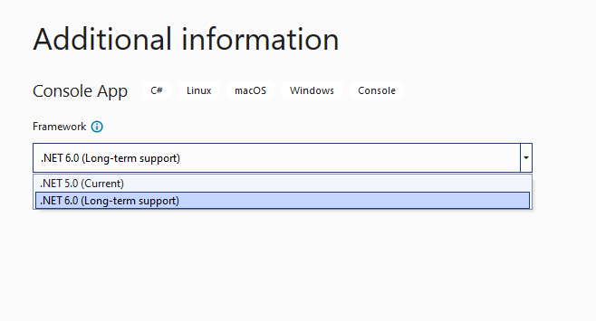

# .NET Release Labels

We started out .NET Core with a clean slate and the opportunity to align with modern industry trends and user expectations. We noticed that there was a significant diversity of approaches used by various projects for their releases and we were inspired by them. In retrospect, we picked a good approach but didn't get the labeling right. Fortunately, the labeling is the easiest part to fix. This document proposes a new approach for labeling .NET releases.

## Release timeframes

Today, we have a few release timeframes:

- Pre-release (previews and release candidates)
- Full support
- Maintenance
- End of life/support

For stable releases (post-GA), we have two support durations:

- Shorter releases, supported for 18 months
- Longer "LTS" releases, supported for 36 months

The shorter releases are released in even years, and the LTS ones in odd years.

## Currently-used labels

Today, we have multiple labels that we apply to releases, as you can see illustrated in the following Visual Studio dialog:



These labels are attempting to describe the following:

- .NET 5 is a "Current" or shorter-supported release.
- .NET 6 is a "Long-term support" or longer-supported release.

We've heard the feedback that "Current" is very confusing, particularly when it describes a release that isn't the latest one. That's the case in this Visual Studio image. It is easy to agree with that.

## Industry examples

Various projects use various terms to describe release types and support timeframes.

- [Node.js](https://nodejs.org/en/about/releases/) releases have "Current", "Active LTS", and "Maintenance LTS" phases. Even-numbered releases move to these two LTS phases after the "Current" phase. Odd-numbered releases are no longer supported after the "Current" phase.
- [OpenJDK](https://access.redhat.com/articles/1299013) releases are supported for 6 years, at least by Red Hat.
- [Python](https://devguide.python.org/devcycle/#branches) releases have "Maintenance" and "Security" phases. Releases are supported for ~5 years.
- [Red Hat Enterprise Linux (RHEL)](https://access.redhat.com/support/policy/updates/errata/) releases have "Full", "Maintenance", and "Extended life" support phases. Each RHEL release is LTS.
- [Ubuntu](https://wiki.ubuntu.com/Releases) releases have "Current" and "Extended Security" support phases. Release are either regular (with no additional label) or LTS. Every two years, there are 3 regular releases and one LTS release. All currently-supported releases are considered "Current".

The industry examples demonstrate that we are using the "LTS" label correctly and the "Current" label incorrectly. The Ubuntu/Canonical model is the closest to our practice.

## Proposed labels

New labels are proposed for a variety of purposes.

**Release-type (support duration) labels:**

- **Standard Support** -- Indicates a release is supported for the Standard Support timeframe (18 months) and currently actively supported.
- **LTS** -- Indicates a release is supported for the Long Term Support (LTS) timeframe (3 years) and currently actively supported.

**Release support status labels:**

- **Preview** -- Indicates a release is in preview and (unless "Go-Live") is unsupported.
- **Go-Live** -- Indicates a preview or release candidate is supported in production.
- **Maintenance** -- Indicates that a release is within 6 months of remaining support, with security fixes only.
- **EOL** -- Indicates that the support has ended ("end of life").

**Other proposed labels:**

- **Latest** -- Indicates that a release is the latest actively supported .NET release (not a Preview or Release Candidate).
- **TILL202212** -- Indicates that a release is supported until a particular month.

Note: "Other proposed labels" are labels that were proposed and that may or may not get used. They are good ideas, so they are being documented. Various pages and viewers of support information can use these labels even if Microsoft chooses not to.

Notes:
 - The **Current** label will no longer be used and will be replaced with **Standard Support**.
 - Labels can use whatever casing makes sense for the artifact. For example, `releases.json` will use all lower-case.

In some views, we can only show one label. In those cases, we will show the most relevant label, which will use the following algorithm:

- show support status label, if
  - support status is "Preview"
  - support status is "Go Live"
  - support status is (Maintenance or  EOL)
- else show release type

For example, the `support-phase` property in `releases-index.json` and `releases.json` will apply this algorithm.

These labels will show up in multiple places, including:

- [.NET Download pages](https://dotnet.microsoft.com/download/dotnet)
- [Release notes](https://github.com/dotnet/core/blob/main/releases.md)
- [releases.json](https://github.com/dotnet/core/blob/main/release-notes/releases-index.json)
- Visual Studio

## In practice

Given this proposal, we will see the following labels used in the following timeframes (with a subset of [releases](https://github.com/dotnet/core/blob/main/releases.md) used as examples).

Now (May 2022):

- .NET Core 3.1 (LTS)
- .NET 5 (EOL)
- .NET 6 (LTS, Latest)
- .NET 7 (Preview, Standard Support)

Just before .NET 7 GA (October, 2022):

- .NET Core 3.1 (Maintenance; LTS)
- .NET 5 (EOL)
- .NET 6 (LTS, Latest)
- .NET 7 (Go-Live, Preview, Standard Support)

At .NET 7 GA (November 2022):

- .NET Core 3.1 (Maintenance, LTS)
- .NET 5 (EOL)
- .NET 6 (LTS)
- .NET 7 (Standard Support, Latest)

Just before .NET 8 GA (October 2023):

- .NET Core 3.1 (EOL)
- .NET 5 (EOL)
- .NET 6 (LTS)
- .NET 7 (Standard Support, Latest)
- .NET 8 (Go-Live, Preview)

At .NET 8 GA (November 2023):

- .NET Core 3.1 (EOL)
- .NET 5 (EOL)
- .NET 6 (LTS)
- .NET 7 (Maintenance, Standard Support)
- .NET 8 (LTS, Latest)

+6 months (May, 2024):

- .NET Core 3.1 (EOL)
- .NET 5 (EOL)
- .NET 6 (Maintenance; LTS)
- .NET 7 (EOL)
- .NET 8 (LTS, Latest)
- .NET 9 (Preview, Standard Support)

At .NET 9 GA (November 2024):

- .NET Core 3.1 (EOL)
- .NET 5 (EOL)
- .NET 6 (EOL)
- .NET 7 (EOL)
- .NET 8 (LTS)
- .NET 9 (Standard Support, Latest)

Notes:

- Release type is not displayed for EOL releases, since it isn't relevant.
- The most relevant label is listed first, for cases where only one label can be shown.

A given presentation (like Visual Studio) can print long-form or alternate versions of these labels. That's out of scope of this document.

## Effect on `releases.json`

`releases.json` is a family of files (and schema) that the .NET Team publishes to enable programatic access to the catalog of .NET releases.

There are two forms of files:

- Singular [`releases-index.json`](https://github.com/dotnet/core/blob/main/release-notes/releases-index.json) file that describes all the major/minor releases, at a high-level.
- Release-specific [`releases.json`](https://github.com/dotnet/core/blob/main/release-notes/6.0/releases.json) file that describes each of the patch releases for each major/minor .NET release.

These files include labels. We have a strong desire to not break the current usage patterns, or as little as possible. They already display the most relevant tag per the scheme proposed in this document. We, however, need to adopt `standard` in place of `current`.

`release-index.json` currently displays the most relevant tag.

For example, this historical use of [`release-index.json` uses the `current` label](https://github.com/dotnet/core/blob/8db1474a58ce69dfca707511e0354ff9ba492437/release-notes/releases-index.json#L23):

```json
{
    "channel-version": "5.0",
    "latest-release": "5.0.11",
    "latest-release-date": "2021-10-12",
    "security": true,
    "latest-runtime": "5.0.11",
    "latest-sdk": "5.0.402",
    "product": ".NET",
    "support-phase": "current",
    "releases.json": "https://dotnetcli.blob.core.windows.net/dotnet/release-metadata/5.0/releases.json"
},
```

`releases.json` users the [same scheme in its header](https://github.com/dotnet/core/blob/8db1474a58ce69dfca707511e0354ff9ba492437/release-notes/5.0/releases.json#L7), as demonstrated below:

```json
{
  "channel-version": "5.0",
  "latest-release": "5.0.11",
  "latest-release-date": "2021-10-12",
  "latest-runtime": "5.0.11",
  "latest-sdk": "5.0.402",
  "support-phase": "current",
  "lifecycle-policy": "https://dotnet.microsoft.com/platform/support/policy/",
  "releases": [
    {
```

Going forward, we'll make the following changes:

- `standard` will be used in place of `current`. This is a breaking change.
- The `support-phase` property will follow the algorithm described earlier.
- A new `release-type` property will be added that will have one of two values: `lts` or `standard`.

We cannot change the existing `support-phase` property significantly, due to compatibility. It will go through the following progression:

`preview` -> `go-live` -> [`lts` | `standard`] -> `maintenance` -> `eol`

The new `release-type` property will be set as either `lts` or `standard` and will not change, even after EOL.

When `release-type` == `support-phase`, that means "active" of "full" support. All other states are self-descriptive.

The new format will look like the following:

```json
{
    "channel-version": "6.0",
    "latest-release": "6.0.5",
    "latest-release-date": "2022-05-10",
    "security": true,
    "latest-runtime": "6.0.5",
    "latest-sdk": "6.0.300",
    "product": ".NET",
    "support-phase": "lts",
    "release-type": "lts",
    "eol-date": "2024-11-12",
    "releases.json": "https://dotnetcli.blob.core.windows.net/dotnet/release-metadata/6.0/releases.json"
},
```

Based on [release-index.json](https://github.com/dotnet/core/blob/77017a2110cd00ce997c7840c2542d7a5ec323a5/release-notes/releases-index.json#L15-L26).

When .NET 6 has 6 months of support left, the support phase property will change to the following value:

```json
    "support-phase": "maintenance",
```

This approach follows established practice.

## Breaking change

Switching from `current` to `standard` is a breaking change. This string doesn't appear anywhere currently since .NET 5 is EOL. .NET 7 is the next standard support release and is currently several months away from being a stable release, at which point `support-phase` == `standard`. As a result, the change is not immediately breaking and enables readers multiple months to react.
