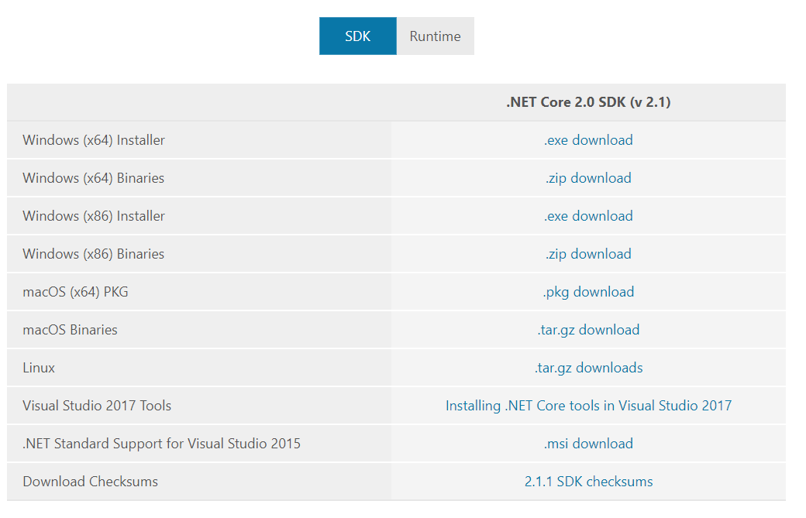
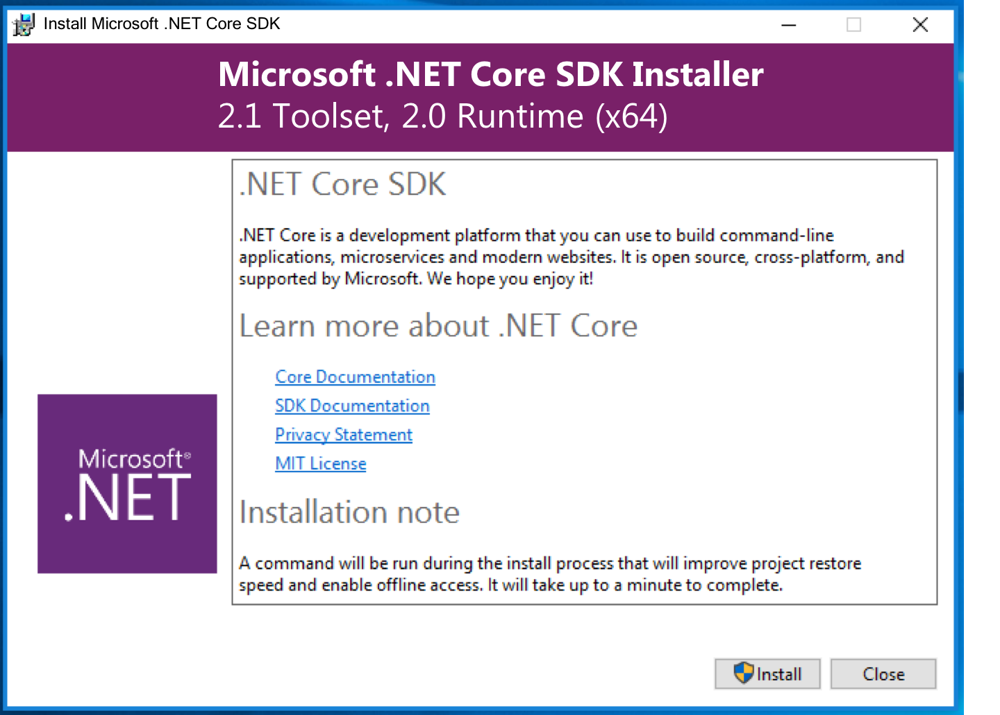
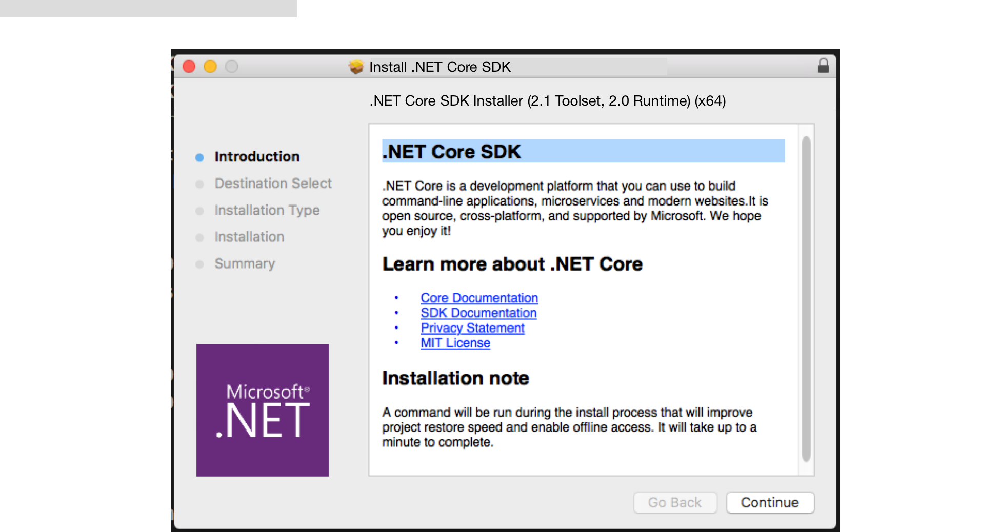

# .NET Core SDK Versioning

We have been shipping .NET Core for almost two years. We have found that the pace of change for adding features to the SDK has been faster than the Runtime. The version numbers will diverge with the next SDK release because it will include new features while the next feature-level release of the Runtime will occur later. We use semver versioning for both distributions to communicate the level of change. Since the SDK moves faster, it will move to a higher minor version sooner than the Runtime.

We will ship the following in Q4 2017:

* .NET Core SDK with 2.1 as its version number.
* .NET Core Runtime with 2.0 as its version number.

The .NET Core Runtime will ship its next feature-level release in H1 2018.

## Context

The .NET Core SDK is the collection of components a developer needs for .NET Core development, specifically a toolset and a runtime to use to build, run and/or test code. The toolset includes the CLI, NuGet, MSBuild, Roslyn and other tools. Each tool is independent and maintains it's own versioning scheme. This plan doesn't change that.

The runtime and SDK have been out of sync since the start of the .NET Core project. The 1.x Runtime and SDK were rarely the same version number. When we shipped .NET Core 2.0, they were in sync again, for a single release.

Soon after shipping .NET Core 2.0, we saw that the next release of the .NET Core SDK would have more significant changes than the corresponding .NET Core Runtime release. This is because of updates in the C# language compiler and NuGet components. Given the level of changes, the semver requirement results in a .NET Core 2.1 SDK. The Runtime released in the same timeframe will have patch level changes, and will be 2.0.x.

While it may be confusing to have runtime and SDK version numbers that share the same major version number but differ by minor version number, like 2.0 and 2.1, we believe this to be the best option.

## Assumptions

The following assumptions informed this plan:

* A .NET Core SDK update will typically ship several times per year because of significant changes in the CLI or components, such as Roslyn or NuGet.
* The .NET Core SDK will remain backwards compatible, enabling developers to always safely use the latest version. For example, the latest SDK is capable of building .NET Core 1.0 projects.

## Goals

The goals for .NET Core SDK versioning follow:

* Support shipping tools to customers at a rapid cadence.
* Enable the .NET Core Runtime and the SDK to ship together or separately, in any combination, whatever is required for a given release.
* Maintain semantic versioning so that developers know which SDK releases to adopt per their needs.
* Maintain a clear and predictable naming convention for SDK distributions, including Docker and Linux package managers.

## Versioning Plan

The version number of the .NET Core SDK will shift away from the .NET Core runtime version number, starting with the next version of the .NET Core SDK. The next version of the .NET Core SDK will be 2.1.1. Skipping 2.1.0 is an unfortunate engineering issue.

The name of the SDK will be:

```
.NET Core [runtime major/minor] SDK ([v SDK major/minor and patch where needed for clarity])

.NET Core 2.0 SDK (v 2.1)
```

### .NET Core SDK Approach to Semver

[Semantic Versioning](http://semver.org/) defines major, minor and patch versioning. 

The .NET Core SDK will ship a minor release in the following cases:

* The .NET Core Runtime has a major or minor release.
* One or more of the tools in the toolset has a major or minor release.
* The CLI has a minor release (such as exposing a new verb).
* A change is made that has minor / edge-case breaking change concern.

We think it most likely that major versions of the .NET Core Runtime and .NET Core SDK would happen simultaneously, since they are designed to work together.

## User Experience

The version change will affect the user experience during download selection, install, filenames and when displaying the version via the --version or --info switches.

### Acquiring the Right Runtime and SDK

The most recent version of the .NET Core SDK can be used to produce applications targeting any previous version of the .NET Core Runtime. So, regardless of the runtime you are targeting, you can download the latest SDK and things will just work.

If you download the latest version of the .NET Core SDK and it does not contain the .NET Core Runtime version you want to target, you can download the desired version from the [.NET Core Runtime Archive](https://github.com/dotnet/core/blob/master/release-notes/download-archive.md). If your global.json file specifies a particular version of the .NET Core SDK, you can find it in the same location.

Each version of the .NET Core SDK ships with a version of the .NET Core Runtime. You can determine the version of the .NET Core Runtime and .NET Core SDK that ship together from the names in the [.NET Core Runtime Archive](https://github.com/dotnet/core/blob/master/release-notes/download-archive.md).

### --version

The proposal for --version is:

```bash
$ dotnet --version
2.1.1
```

This value was chosen because:

* It is the same behavior we already have.
* Developers rely on this value to copy/paste into global.json.

Unfortunately, some people may expect this value to be the runtime version. It isn't. Given the singular nature of this value, it only makes sense to be the SDK.

### --info

The current data reported by the --info switch is a bit inconsistent and unclear. Since we have to change it anyway to clarify the different .NET Core SDK and .NET Core, it's a good time to make other improvements.

Info serves several purposes.

* It is an opportunity to be really clear about versioning.
* It is an important source of information about machine configuration for anyone doing support.
* It is the only current reliable source for the current machine's RID.
* It is parsed to get the base SDK path for the current .NET Core SDK. There are better ways to accomplish what underlies this goal, but as an interim, we don't want to break this scenario unnecessarily.

Except for RID, parsing is not desirable because the results of --info is localized.

To add clarity and allow parsing in the unusual case where it is still needed, each line will have a unique heading that will fully describe it's contents. The position within the document - the header - will no longer be needed for understanding. The exception to this is the base path, which will remain "Base Path" to avoid breaking currently known scenarios.

The general form will be:

```bash
[whitespace]FixedName:[whitespace]Value
```

The new values will be:

| Changed | Current group/identifier      | Current format     | Proposed identifier   | Proposed format                    |
|---------|-------------------------------|--------------------|-----------------------|------------------------------------|
| Yes     | .NET Command Line Tools       | (2.0.0)            | (removed)             | n/a                                |
| Yes     | Product Information:Version   | 2.0.0              | SDK Version           | 2.1.n                             |
| Yes     | Product Information:Commit... | (hash)             | SDK Build             | (build number)                     |
| No      | Runtime Env...:OS Name        | Mac OS X           | OS Name               | Mac OS X                           |
| No      | Runtime Env...:OS Version     | 10.12              | OS Version            | 10.12                              |
| No      | Runtime Env...:OS Platform    | Darwin             | OS Platform           | Darwin                             |
| No      | Runtime Env...:RID            | osx.10.12-x64      | RID                   | osx.10.12-x64                      |
| Yes     | Runtime Env...:Base Path      | /usr/...sdk/2.0.0/ | Base Path             | /usr/local/share/dotnet/sdk/2.0.0/ |
| Yes     | Microsoft...Host:Version      | (2.0.0)            | SDK .NET Core Version | 2.n.n                              |
| Yes     | Microsoft...Host:Build        | (build number)     | SDK .NET Core Build   | (build number)                     |

```bash
$ dotnet --info
.NET Core SDK Information:
  SDK Version:  2.1.1
  SDK Build:    e8b8861ac7faf042c87a5c2f9f2d04c98b69f28d

Runtime Environment:
  OS Name:      Mac OS X
  OS Version:   10.12
  OS Platform:  Darwin
  RID:          osx.10.12-x64
  Base Path:    /usr/local/share/dotnet/sdk/2.0.0/

.NET Core Host (dotnet) Information:
  Host Version: 2.0.3
  Host Build:   fab8861ac7faf042c87a5c2f9f2d04c98b69f297

```

We may add more information to this output in the future.

### When the SDK is not installed

The dotnet command can be used when the SDK is not installed, primarily to allow running .NET shared framework apps. In this mode, --info returns:

```bash
$ dotnet --info

Microsoft .NET Core Shared Framework Host

  Version  : 2.0.0
  Build    : e8b8861ac7faf042c87a5c2f9f2d04c98b69f28d
```

The _Microsoft .NET Core Shared Framework Host_ runs shared framework applications. The host is not being updated as part of this change and will continue to display the same information. The version number of the host is significant only for error reporting. This output may not be clear and is tracked as [an issue](https://github.com/dotnet/core-setup/issues/3358).

When the SDK is not installed, no SDK version can be returned. The output continues to be:

```bash
$ dotnet --version
Did you mean to run dotnet SDK commands? Please install dotnet SDK from:
  http://go.microsoft.com/fwlink/?LinkID=798306&clcid=0x409
```

### Download Page

The download will be similar to the current download page, but include the 2.1 toolset sub-description:



### Install Screens

The install screen for Windows:



Note: The Windows mockup uses fonts that differ slightly in height and weight. An effort was made to make the width correct.

The install screen for Mac:



### Docker Tag Names

Docker is the most challenging of our many distributions, because of all of its constraints. It is a good stress-test for the new SDK versioning scheme.

The proposed solutions is

```
RUNTIME_VERSION-sdk-TOOLSET_VERSION
```

such as

* 2.0.3-sdk-2.1.1