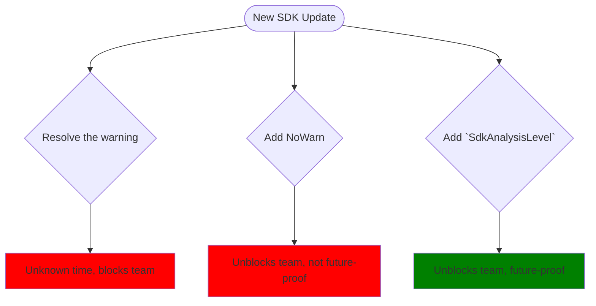

# SDK Analysis Level Property and Usage


**Owner** (PM) [Chet Husk](https://github.com/baronfel) | (Engineering) [Daniel Plaisted](https://github.com/dsplaisted)

Today, users of the .NET SDK have a large degree of control over the way that the .NET SDK and the
tools bundled in it emit diagnostics (warnings and errors). This control is provided in part by a
series of MSBuild properties that control the severity levels of specific warnings, if certain messages
should be treated as diagnostics, even a coarse-grained way to set the entire analysis baseline for a project.

The default values for these properties are often driven by the Target Framework(s) chosen for a project, and
as a result users have developed an expectation of behaviors around changing the Target Framework of a project.
It's generally understood that when a TFM is changed, new kinds of analysis may be enabled, and as a result what
was a successful build may now have errors.

This cadence is predictable and repeatable for users - new TFMs are generally only introduced once a year - but
for tooling developers this cadence means that important changes can generally only be tied to a new TFM release.
New diagnostics can be introduced mid cycle, but they can only be enabled by default in a new TFM. Failure to adhere
to this pattern results in pain for our users, as they are often not in control of the versions of the SDK used
to build their code, often because their environment is managed by an external force like an IT department or
a build environment.

Some changes are not able to be logically tied to the TFM, however, and we have no toolset-level parallels
to the existing MSBuild Properties of `AnalysisLevel`, `WarningLevel`, `NoWarn`, etc. This means we have no way to introduce
changes that are activated just by installing a particular version of the SDK, and we have no clear way
to communicate intent to tools that naturally operate outside of the scope of a project - like NuGet at
the repo/solution level.

To fill this gap, and to provide users a way to simply and easily control the behaviors of the SDK and tools,
I propose that we:

* Add a new property called `SdkAnalysisLevel` to the base .NET SDK Targets, right at the beginning of target evaluation
* Set this property default value to be the `MAJOR.Minor.FeatureBand` of the current SDK (e.g. 7.0.100, 7.0.400, 8.0.100)
* Increment this value in line with the SDK’s actual version as it advances across releases
* Use this property to determine the default values of existing properties like `AnalysisLevel` and `WarningLevel` in the absence of any user-provided defaults
* Pass this value wholesale to tools like the compilers – where there is a complicated decision matrix for determining the effective verbosity of any given diagnostic

## Scenarios and User Experience

### Scenario 1: Jolene doesn't control her CI/CD environment

In this scenario Jolene is a developer on a team that uses a CI/CD environment that is
managed by an external team. The infrastructure team has decided that the version of the .NET SDK that
will be preinstalled on the environment will be 8.0.200, but this version introduced a new
warning that is treated as an error by default. At this point, Jolene has a few choices to make about how to resolve this error.

* Resolve the new warning. This may take an indeterminate amount of time, and blocks the teams progress in the meantime.
* Add a `NoWarn` for the new warning(s) and continue working. This unblocks the team but can be a bit of a whack-a-mole situation, as new warnings will require new `NoWarn`s.
* Add a `SdkAnalysisLevel` with a value of the SDK she was previously using. This unblocks the team and informs tooling of the desired unified warnings experience that Jolene's team is coming from.



After assessing these choices Jolene's team doesn't have time to fix the
diagnostic until next month, so for now she instructs the build to behave as if it were
using the 8.0.100 SDK by setting the `SdkAnalysisLevel` property to `8.0.100` in a
`Directory.Build.props` file in her repo root:

```xml
<Project>
    <PropertyGroup>
        <SdkAnalysisLevel>8.0.100</SdkAnalysisLevel>
    </PropertyGroup>
</Project>
```

### Scenario 2: Marcus is on a GPO-managed device

Marcus is working on a small single-project .NET MAUI app, and his company manages his hardware via GPO.
On release day, the company pushed out Visual Studio updates to his team, and as a result his prior
feature band of `8.0.200` is no longer available - it's been replaced by `8.0.300`. He's not sure
about these warnings new warnings so he unblocks himself by setting `<SdkAnalysisLevel>8.0.200</SdkAnalysisLevel>`
in his project file to unblock builds until he has time to investigate.

---

In both of these scenarios, the user is *not in control* of their environment. They can control their code,
but they do not have the time to address the full set of problems introduced by an update. They use the new
property to request older behavior, for a _limited time_, until they can address the issues. In addition,
this single property was able to control the behavior of the SDK, the compilers, and any other tools that
have been onboarded to the new scheme, without having to look up, comment out, or add many  `NoWarn` properties
to their project files.


## Requirements

### Goals

* Users have a unified way to manage diagnostics for all the tools in the SDK
* Tooling has a way to understand what compatibility level a user explicitly wants
* Users are able to upgrade across SDKs without being forced to immediately resolve warnings
* Tools bundled in the SDK adopt `SdkAnalysisLevel` as a guideline

<!--
Provide a bullet point list of aspects that your feature has to satisfy. This
includes functional and non-functional requirements. The goal is to define what
your feature has to deliver to be considered correct.

You should avoid splitting this into various product stages (like MVP, crawl,
walk, run) because that usually indicates that your proposal tries to cover too
much detail. Keep it high-level, but try to paint a picture of what done looks
like. The design section can establish an execution order.
-->

### Non-Goals

* Users keep using `SdkAnalysisLevel` indefinitely
* Microsoft-authored tools delivered outside the SDK adhere to `SdkAnalysisLevel`
* Non-Microsoft authored tools adhere to `SdkAnalysisLevel`

<!--
Provide a bullet point list of aspects that your feature does not need to do.
The goal of this section is to cover problems that people might think you're
trying to solve but deliberately would like to scope out. You'll likely add
bullets to this section based on early feedback and reviews where requirements
are brought that you need to scope out.
-->

## Stakeholders and Reviewers

| Team | Representatives |
| ---- | --------------- |
| SDK | @marcpopmsft @dsplaisted |
| MSBuild | @rainersigwald @ladipro |
| NuGet | @aortiz-msft @nkolev92 |
| Roslyn | @jaredpar @CyrusNajmabadi |
| F# | @vzarytovskii @KevinRansom |
| PM | @KathleenDollard @MadsTorgersen |

## Design

### Valid values of `SdkAnalysisLevel`

The implementation of `SdkAnalysisLevel` is itself quite straightforward - the default value of `SdkAnalysisLevel` is always
the stable 'SDK Feature Band' of the SDK that is currently being run, and the only valid values for the property are other SDK Feature Bands.
An SDK Feature Band is a Semantic Version of the form `<Major>.<Minor>.<Patch>`, where the `<Patch>` version is a multiple of 100. Some
valid feature bands for this discussion might be 6.0.100, 7.0.300, or 8.0.200.

### Where to define `SdkAnalysisLevel`

The more interesting question is where such a value might be set. Users typically set values for properties in one of three ways:

* as a MSBuild global property via an environment variable or `-p` option of MSBuild/.NET CLI
* as a MSBuild local property in a Project file (or MSBuild logic Imported by a project file)
* as a MSBuild local property in a Directory.Build.props file (this is broadly the same as option 2 but happens implicitly)

If we would like users to be able to set this new property in any of these, the SDK cannot set a default value until after the Project file has been evaluated.
If we want all of the build logic in `.targets` files to be able to consume or derive from the value then we must set the value as early as possible.
These two constraints point to setting the property as early as possible during the `.targets` evaluation of the SDK - for this reason
we should calculate the new property [at the beginning of the base SDK targets](https://github.com/dotnet/sdk/blob/558ea28cd054702d01aac87e547d51be4656d3e5/src/Tasks/Microsoft.NET.Build.Tasks/targets/Microsoft.NET.Sdk.targets#L11).

### Relation to existing WarningLevel and AnalysisLevel properties

These properties cover a lot of the same ground, but are defined/imported [too late in project evalation](https://github.com/dotnet/sdk/blob/558ea28cd054702d01aac87e547d51be4656d3e5/src/Tasks/Microsoft.NET.Build.Tasks/targets/Microsoft.NET.Sdk.targets#L1315) to be usable by the rest of the SDK. In addition,
we cannot safely move their evaluation earlier in the overall process due to compatibility concerns. Since `SdkAnalysisLevel` will be defined earlier,
we should define how it impacts these two. Curently WarningLevel and AnalysisLevel are [hardcoded](https://github.com/dotnet/sdk/blob/558ea28cd054702d01aac87e547d51be4656d3e5/src/Tasks/Microsoft.NET.Build.Tasks/targets/Microsoft.NET.Sdk.Analyzers.targets#L25C6-L25C26) and must be updated with each new SDK. We will change this to infer the AnalysisLevel based on the value of `SdkAnalysisLevel` - the `<Major>` portion of the `SdkAnalysisLevel` will become the value of `AnalysisLevel`, which itself influences the default for `WarningLevel`.

## Q & A

<!--
Features evolve and decisions are being made along the road. Add the question
as a subheading and provide the explanation for the decision below. This way,
you can easily link to specific questions.

When you find yourself having to explain something in a GitHub discussion or in
email, consider to update your proposal and link to your answer instead. This
way, you avoid having to explain the same thing over and over again.
-->
